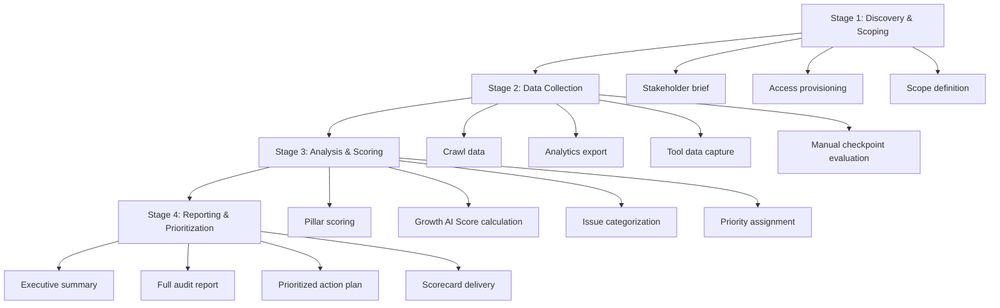

# Methodology

**Growth AI SEO Audit Framework™**
Version 1.0.0 — Technocrats Digimate Pvt. Ltd.

---

## Audit Workflow Overview

The Growth AI SEO Audit Framework™ follows a structured four-stage workflow. Each stage has defined inputs, activities, and outputs. Stages must be completed sequentially because each stage produces information that the next stage requires.

---

## Stage 1: Discovery and Scoping

### Purpose

Establish the context necessary to conduct a meaningful audit. An audit conducted without adequate discovery produces findings that are technically accurate but strategically misaligned.

### Activities

**Stakeholder Brief**

Complete the stakeholder brief worksheet (`/worksheets/stakeholder-brief.md`) with the primary client contact. Capture:

- Business model and primary revenue sources
- Organic search goals (traffic, leads, revenue, brand)
- Known existing problems or concerns
- Previous SEO work performed
- Technical constraints (platform, hosting, CMS, engineering access)
- Competitor references
- Geographic and language scope

**Access Provisioning**

Obtain credentials and access for:

- Google Search Console (full property access, not read-only)
- Google Analytics 4 (editor or analyst access)
- Crawl tool access (IP whitelisting if required)
- CMS admin access (for template and metadata review)
- Hosting or CDN dashboard (for configuration review)
- Log file access (if server log analysis is in scope)

**Scope Definition**

Confirm:

- Which website sections or subdomains are in scope
- Which pages are excluded (login pages, admin areas, staging environments)
- Whether international or multilingual content is in scope
- Whether third-party platforms (landing page builders, blog subdomains) are in scope
- Estimated page count in scope

Document scope boundaries in writing and obtain stakeholder confirmation before proceeding.

### Outputs

- Completed stakeholder brief
- Confirmed access list
- Written scope definition
- Estimated audit timeline

---

## Stage 2: Data Collection

### Purpose

Collect the raw data that checkpoint evaluations require. Thorough data collection prevents incomplete findings and reduces the need for return visits to tools mid-analysis.

### Activities

**Crawl Execution**

Configure and run a full crawl of the in-scope property using a dedicated crawl tool. Crawl configuration requirements:

- User agent: Googlebot (desktop)
- Crawl speed: Respect robots.txt crawl-delay if present; otherwise use a rate that matches the site's server capacity
- JavaScript rendering: Enable for at least a representative sample of page types
- Sitemap: Import all declared sitemaps as crawl starting points
- Custom extraction: Configure extraction rules for canonical tags, hreflang attributes, structured data, heading hierarchy, and page titles

Export crawl data in full before analysis.

**Search Console Data Export**

Export from Google Search Console:

- Performance data: Queries, pages, countries, devices — last 16 months where available
- Coverage report: Indexed, not indexed, error pages — current state
- Sitemaps: Status, submitted count, indexed count
- Core Web Vitals: Mobile and desktop assessment
- Manual actions: Active and previous
- Security issues: Active findings
- Links: Top linked pages, top linking sites, top anchor text

**Analytics Export**

Export from Google Analytics 4:

- Organic traffic by page — last 12 months
- Conversion events by source — last 12 months
- User engagement metrics (engagement rate, time on site, pages per session) — last 12 months
- Landing page performance — last 12 months
- Search term data if enhanced measurement is configured

**Manual Checkpoint Data**

Some checkpoints require manual evaluation that cannot be automated. Record these evaluations directly in the relevant checkpoint files using the standard checkpoint template.

### Outputs

- Crawl export files
- Search Console data exports
- Analytics exports
- Manual evaluation notes
- Screenshot evidence log

---

## Stage 3: Analysis and Scoring

### Purpose

Translate raw data into findings and scores. Each finding maps to a checkpoint, which maps to a pillar. Pillar scores combine to produce the Growth AI Score™.

### Activities

**Checkpoint Evaluation**

Work through each checkpoint in sequence. For each checkpoint:

1. Review the checkpoint objective and criteria
2. Apply the data collected in Stage 2
3. Determine pass or fail
4. Record evidence captured
5. Assign a checkpoint score (see `SCORING.md`)
6. Document observed issues with specificity

**Pillar Scoring**

When all checkpoints in a pillar are evaluated, calculate the pillar score using the weighted formula defined in `SCORING.md`.

**Growth AI Score Calculation**

Apply pillar weights to calculate the composite Growth AI Score™.

**Issue Categorization**

Categorize all failures using the standard taxonomy:

| Category | Definition |
|----------|------------|
| Critical | Causes or is likely causing material search performance loss now |
| High | Will cause measurable performance degradation if not addressed |
| Medium | Limits optimization ceiling; not causing immediate harm |
| Low | Best practice gap; negligible immediate impact |

**Priority Assignment**

Apply the priority matrix (`/worksheets/priority-matrix.md`) to assign implementation priority to each finding, accounting for:

- Category severity
- Estimated business impact
- Implementation complexity
- Resource requirements

### Outputs

- Completed checkpoint evaluations
- Pillar scores
- Growth AI Score™
- Categorized and prioritized finding list

---

## Stage 4: Reporting and Prioritization

### Purpose

Communicate findings clearly to stakeholders at appropriate levels of detail.

### Outputs

**Executive Summary**

A two-to-four page document using the executive summary template. Covers:

- Growth AI Score™ with pillar breakdown
- Top three to five findings with business impact
- Recommended priority order
- Estimated outcomes if recommendations are implemented

**Full Audit Report**

A complete document organized by pillar, containing:

- Pillar score and summary
- All evaluated checkpoints with findings
- Evidence references
- Recommendations with implementation guidance
- Estimated resolution time and difficulty per finding

**Prioritized Action Plan**

A spreadsheet or table listing all findings with:

- Checkpoint ID
- Finding description
- Priority (Critical / High / Medium / Low)
- Assigned owner
- Target completion date
- Estimated hours

**Scorecard**

The completed Growth AI Scorecard (`/scorecards/growth-ai-scorecard.md`) with all pillar and composite scores recorded.

---

## Audit Types

### Full Audit

All nine pillars evaluated at full checkpoint depth. Appropriate for:

- New client onboarding
- Annual benchmark reviews
- Post-penalty recovery assessment
- Pre-launch evaluation for major site migrations

**Typical timeline:** 10 to 15 business days

### Pillar Audit

One or two pillars evaluated at full depth. Appropriate for:

- Targeted issue investigation
- Post-implementation validation
- Focused competitive response

**Typical timeline:** 3 to 5 business days per pillar

### Rapid Audit

High-priority checkpoints across all pillars, excluding deep investigation of secondary issues. Appropriate for:

- Prospect assessment
- Quick health check
- Budget-constrained engagements

**Typical timeline:** 3 to 5 business days

---

## Checkpoint Execution Order

Within each pillar, checkpoints are numbered in the recommended execution order. This order reflects dependencies: earlier checkpoints often provide data that later checkpoints require.

**Recommended cross-pillar execution order:**

1. Technical Intelligence™ (must be completed first)
2. Content Intelligence™
3. Entity Intelligence™
4. Authority Intelligence™
5. AI Visibility Intelligence™
6. UX Intelligence™
7. Conversion Intelligence™
8. Analytics Intelligence™
9. Competitive Intelligence™

This order is a recommendation, not a requirement for rapid or pillar audits.

---

## Evidence Standards

Every checkpoint finding must be supported by evidence. Evidence takes one of three forms:

**Data evidence:** Exports from tools — crawl data, Search Console data, analytics data. Reference the specific row, metric, or export file.

**Visual evidence:** Screenshots of the browser, tool interface, or page source. Screenshots must be date-stamped and include the URL visible.

**Diagnostic output:** Results from a specific tool command, API query, or test. Include the tool name, query, and full output.

Evidence is not optional. A finding without evidence cannot be defended in a stakeholder review and cannot be used as a baseline for future comparison.

---

## Quality Assurance

### Peer Review

All audits must be peer-reviewed by a second qualified practitioner before delivery. The reviewer checks:

- Checkpoint criteria applied correctly
- Scores calculated accurately
- Evidence supports findings
- Recommendations are appropriate to findings
- Formatting matches framework standards

### Client Review Session

Schedule a working session with the client to review findings before finalizing the report. This session surfaces any context the auditor lacked during analysis and increases client confidence in the findings.

---

*Next: [SCORING.md](SCORING.md) — The Growth AI Score™ specification*
