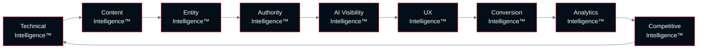
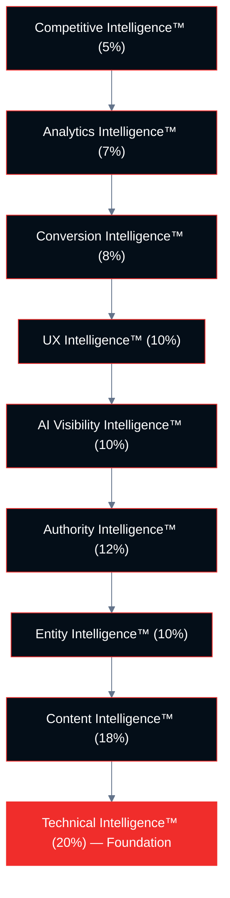
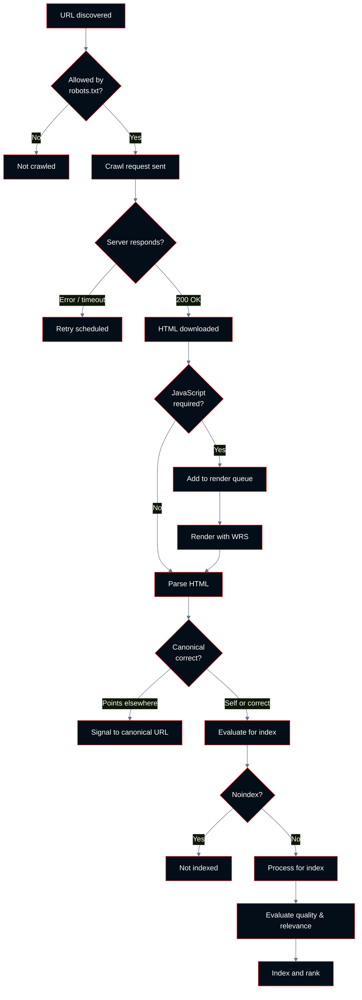

# Chapter 01: Foundations

**Growth AI SEO Audit Framework™**
Version 1.0.0 — Technocrats Digimate Pvt. Ltd.

---

## Purpose of This Chapter

This chapter establishes the conceptual and operational foundations on which the entire framework rests. Before evaluating any checkpoint, a practitioner must understand: what search engines are optimizing for, how modern search has evolved, and what the relationship is between technical infrastructure, content quality, and user behavior in current ranking systems.

This chapter does not contain checkpoints. It contains the knowledge that checkpoint evaluation requires.

---

## The Modern Search Ecosystem

### How Search Has Changed

Search engine optimization as practiced before 2020 operated in a relatively stable environment. The primary variables were: content relevance to query keywords, the number and quality of backlinks pointing to a page, and basic technical accessibility.

That environment no longer exists.

The current search ecosystem is characterized by:

**Generative AI in search results.** Google's AI Overviews synthesize information from multiple sources and present it as a direct answer above traditional results. This creates a new category of search visibility — inclusion in an AI-generated response — that is distinct from ranking in traditional results and requires different optimization.

**User behavior as a signal.** Google's documentation and patents indicate that user engagement patterns — click behavior, return-to-SERP rates, time on page, and scroll depth — contribute to how pages are evaluated over time. A page that ranks but fails to satisfy users is more likely to lose its position than one that satisfies them.

**EEAT as an explicit evaluation framework.** Experience, Expertise, Authoritativeness, and Trustworthiness (EEAT) are documented criteria in Google's Search Quality Rater Guidelines. These criteria affect how human raters evaluate search quality and, by extension, how Google's systems are trained. They are not optional considerations for serious SEO work.

**Core Web Vitals as ranking signals.** Since May 2021, Google has included page experience signals — specifically Core Web Vitals — as confirmed ranking factors. The current Core Web Vitals metrics are LCP, INP, and CLS.

**Entity-based understanding.** Google's knowledge graph is central to how it understands queries and pages. Modern SEO requires that a web property be understood as a coherent entity with specific topical associations, not merely as a collection of keyword-optimized pages.

**JavaScript rendering complexity.** A significant portion of modern web properties rely on JavaScript frameworks for content rendering. Google renders JavaScript, but this rendering happens asynchronously and is subject to resource constraints. Content that is only available after JavaScript execution may be indexed with delay or may not be indexed at all.

---

## The Growth AI Flywheel

The relationship between the nine intelligence pillars is not linear. Improvements in each pillar reinforce improvements in others, creating a compounding effect over time.

**Technical Intelligence™** enables crawling and indexation. Without this, no other investment in the property is discoverable.

**Content Intelligence™** determines whether indexed pages satisfy user intent. Without this, rankings may be achieved briefly but not sustained.

**Entity Intelligence™** builds topical authority associations that allow Google to understand what a site is about at a structural level, enabling it to rank for related queries not explicitly targeted.

**Authority Intelligence™** provides the external trust signal that differentiates competing properties when content quality is equivalent.

**AI Visibility Intelligence™** structures content in ways that AI search products can synthesize and cite, creating a new visibility channel alongside traditional SERP positions.

**UX Intelligence™** ensures that traffic earned through the above pillars converts at a rate consistent with business objectives.

**Conversion Intelligence™** maximizes the business return from organic traffic.

**Analytics Intelligence™** provides the measurement infrastructure that allows all other pillar performance to be observed, attributed, and improved.

**Competitive Intelligence™** provides the context needed to prioritize work and set realistic performance targets.

---

## The Growth AI Pyramid

The pyramid structure shows the dependency hierarchy. Base layers must be structurally sound before investments in higher layers produce reliable returns.

---

## How Google Discovers and Ranks Content

Understanding the mechanics of search is necessary for understanding why checkpoints are designed the way they are.

### Discovery

Google discovers content through:

1. **Crawling:** Googlebot follows links from known pages to discover new URLs
2. **Sitemaps:** XML sitemaps explicitly notify Google of URLs it should crawl
3. **Direct submission:** Google Search Console allows direct URL inspection and submission

### Crawl Lifecycle

### Indexation

After crawling, Google evaluates whether a page should be indexed. A page may not be indexed if:

- The `noindex` directive is present in the page's meta robots tag or HTTP header
- The canonical tag points to a different URL
- Google determines the page is low-quality, thin, or duplicate
- The page requires authentication to access
- The page is blocked by robots.txt (though Google can still index URLs discovered elsewhere that are robots.txt blocked)

### Ranking

Google's ranking systems evaluate hundreds of signals to determine where a page should appear for a given query. The signals most relevant to this framework include:

- **Relevance signals:** How well the content addresses the query intent
- **Quality signals:** EEAT indicators, content depth, originality
- **Authority signals:** PageRank and equivalent link-based authority
- **Page experience signals:** Core Web Vitals, mobile usability, HTTPS
- **User behavior signals:** Engagement patterns observed over time

---

## What AI Search Changes

### Traditional Search vs. AI Search

| Dimension | Traditional Search | AI Search (AI Overviews, Perplexity, etc.) |
|-----------|-------------------|------------------------------------------|
| Result type | List of ranked links | Synthesized answer with attributed sources |
| Visibility unit | Ranking position | Inclusion in synthesized response |
| Selection criteria | Relevance + authority | Synthesizability + factual reliability + source diversity |
| Click behavior | User clicks through to read | User may get answer without clicking through |
| Content requirements | Keyword relevance + EEAT | Clear factual statements + structured responses + authority |

### Implications for This Framework

AI search visibility does not replace traditional search optimization. It adds a new dimension. The AI Visibility Intelligence™ pillar evaluates this dimension specifically.

The most important implication is that content which answers questions clearly, with verifiable facts, in plain language, with clear authorship and source attribution, performs better in AI search contexts. These properties also tend to perform well in traditional search contexts. There is no fundamental conflict between optimizing for AI search and optimizing for traditional search. There are, however, additional structural requirements for AI search that traditional optimization does not cover.

---

## EEAT: The Quality Framework

EEAT stands for Experience, Expertise, Authoritativeness, and Trustworthiness. These concepts appear in Google's Search Quality Rater Guidelines and represent how Google thinks about content quality at a systemic level.

### Experience

Does the content creator have first-hand or life experience with the topic? A review written by someone who used the product demonstrates experience. A review written based on other reviews does not.

**Audit implication:** Look for bylined content, case studies, original research, and specific details that could only come from direct experience.

### Expertise

Does the content creator have formal or demonstrated knowledge of the topic? Medical content written by a licensed physician demonstrates expertise. The same content written by a general content writer does not.

**Audit implication:** Look for author bios, credentials, publications, affiliations, and expert attribution.

### Authoritativeness

Is the website recognized by other authoritative sources as a reliable reference on the topic? Links from relevant, authoritative sites are the primary signal here.

**Audit implication:** Evaluate the backlink profile through the lens of topical relevance, not just domain authority metrics.

### Trustworthiness

Is the website honest, accurate, and safe? This includes: accurate contact information, transparent ownership, secure HTTPS, accurate factual claims, and clear disclosure of commercial relationships.

**Audit implication:** Check for contact information, About pages, privacy policies, and any content that makes unverifiable or demonstrably false claims.

---

## Search Intent: The Primary Content Criterion

Search intent — also called user intent — is the underlying goal of a search query. Google's primary function is to match queries to content that satisfies the intent behind them. A page that answers the literal query but not the underlying intent will not perform as well as one that addresses the intent directly.

### The Four Intent Categories

**Informational:** The user wants to learn something.
*Example query: "how does server-side rendering affect SEO"*
*Content type: Guides, tutorials, explanations, definitions*

**Navigational:** The user wants to reach a specific website or page.
*Example query: "Google Search Console login"*
*Content type: The destination page itself*

**Commercial Investigation:** The user is researching options before making a decision.
*Example query: "best crawl budget tools comparison"*
*Content type: Comparison pages, reviews, buyer guides*

**Transactional:** The user is ready to take an action.
*Example query: "buy enterprise SEO audit template"*
*Content type: Product pages, pricing pages, landing pages*

### Intent Mismatch

The most common content failure in SEO is intent mismatch: a page optimized for a query that expresses one type of intent when the page itself satisfies a different intent. For example, a product page ranking for an informational query, or a blog post ranking for a transactional query.

Intent mismatch is evaluated in the Content Intelligence™ pillar under checkpoint CI-001.

---

## Topical Authority

Topical authority is the degree to which a website is recognized as a comprehensive and reliable source on a given subject area. A website with strong topical authority ranks more easily for new content on that subject than a website with weaker topical authority, even when other factors are equal.

Topical authority is built through:

- **Comprehensiveness:** Covering a topic across all relevant subtopics and query types
- **Depth:** Providing content that addresses each subtopic with sufficient detail
- **Consistency:** Maintaining a clear subject-matter focus across the site
- **Entity associations:** Being associated in Google's knowledge graph with the relevant entities for the topic

Topical authority is evaluated across the Content Intelligence™ and Entity Intelligence™ pillars.

---

## Information Gain

Information gain is the degree to which a piece of content adds information that is not available in other sources ranking for the same query. Google's research has documented information gain as a signal in its ranking systems.

Content with high information gain:

- Contains original research, data, or analysis
- Provides first-hand experience that is not available elsewhere
- Synthesizes existing knowledge in a novel and useful way
- Answers questions that competing content does not address

Content with low information gain:

- Repeats the same information as all other ranking results
- Aggregates content from other sources without adding interpretation
- Uses different words to say the same thing as existing content

Information gain is evaluated in the Content Intelligence™ pillar under checkpoint CI-002.

---

## Structured Data and Schema

Structured data, implemented primarily through Schema.org vocabulary and JSON-LD encoding, allows publishers to provide explicit information about the content of a page in a machine-readable format. Google uses structured data to:

- Generate rich results (product panels, review stars, FAQ accordions, etc.)
- Understand entity relationships
- Improve the accuracy of AI-generated answers that reference the page
- Determine eligibility for specific SERP features

The framework evaluates structured data across multiple pillars:

- Technical validity: TI-020
- Organization and entity schema: EI-003, EI-004, EI-005
- AI-specific schema: AV-003, AV-009

---

## Key Terms Used in This Framework

The following terms are used with consistent, specific meanings throughout the framework.

| Term | Definition as Used in This Framework |
|------|--------------------------------------|
| Canonical | The preferred version of a URL, as specified by the `rel="canonical"` tag |
| Crawl budget | The number of URLs Googlebot will crawl on a site in a given timeframe |
| Indexation | The inclusion of a URL in Google's search index |
| Render | The execution of JavaScript to produce the final DOM of a page |
| Entity | A named thing — person, organization, product, concept — that Google's knowledge graph recognizes |
| Topical authority | The degree to which a site is recognized as a reliable source on a subject area |
| Information gain | The degree to which content adds information not available in competing sources |
| AI Overview | Google's generative AI-powered search result feature that synthesizes answers from multiple sources |
| Page experience | The set of signals Google uses to evaluate the user experience of a page, including Core Web Vitals |
| EEAT | Experience, Expertise, Authoritativeness, and Trustworthiness — Google's content quality framework |

For a complete glossary, see `/appendix/glossary.md`.

---

## Chapter Summary

This chapter has established:

1. The modern search ecosystem and how it differs from the pre-2020 environment
2. The Growth AI Flywheel — how the nine pillars reinforce each other
3. The Growth AI Pyramid — the dependency hierarchy of the pillars
4. How Google discovers, crawls, and indexes content
5. What AI search changes about optimization requirements
6. EEAT as a quality evaluation framework
7. Search intent as the primary content criterion
8. Topical authority and information gain as ranking signals
9. Structured data's role across multiple pillars
10. Key terms used consistently throughout the framework

---

*Next: [02-technical-intelligence.md](02-technical-intelligence.md) — Technical Intelligence™ pillar*
