# Chapter 02: Technical Intelligence™

**Growth AI SEO Audit Framework™**
Version 1.0.0 — Technocrats Digimate Pvt. Ltd.

---

## Pillar Overview

**Pillar:** Technical Intelligence™
**Weight in Growth AI Score™:** 20%
**Checkpoint range:** TI-001 – TI-020
**Total checkpoints:** 20
**Maximum pillar score:** 60 (20 checkpoints × 3 points)

Technical Intelligence™ is the foundation of the entire framework. It evaluates whether a web property is technically accessible to search engine crawlers, whether content can be rendered and understood, and whether the infrastructure supports efficient discovery and indexation at scale.

Technical failures in this pillar do not merely lower the score — they can prevent all other optimization work from producing results. A site with excellent content, strong authority, and optimal user experience that cannot be crawled effectively will not rank.

---

## Architecture

```mermaid
%%{init: {'theme': 'base', 'themeVariables': {'primaryColor': '#040E18', 'primaryTextColor': '#FFFFFF', 'primaryBorderColor': '#F02D2B', 'lineColor': '#64748B', 'fontFamily': 'Inter, sans-serif'}}}%%
flowchart TD
    A[Technical Intelligence™] --> B[Crawl Access]
    A --> C[Indexation Control]
    A --> D[Rendering]
    A --> E[Architecture]
    A --> F[Security & Trust]

    B --> B1[TI-001 Robots.txt]
    B --> B2[TI-002 XML Sitemaps]
    B --> B3[TI-003 Crawl Budget]
    B --> B4[TI-013 Crawl Errors]
    B --> B5[TI-016 Log File Analysis]

    C --> C1[TI-004 Canonical Tags]
    C --> C2[TI-008 Duplicate Content]
    C --> C3[TI-011 Indexation Accuracy]
    C --> C4[TI-018 Pagination]

    D --> D1[TI-007 JavaScript Rendering]
    D --> D2[TI-009 Hreflang]
    D --> D3[TI-019 CDN Configuration]

    E --> E1[TI-006 Redirects]
    E --> E2[TI-012 Internal Links]
    E --> E3[TI-015 URL Structure]
    E --> E4[TI-017 Faceted Navigation]

    F --> F1[TI-005 HTTPS]
    F --> F2[TI-010 Mobile Config]
    F --> F3[TI-014 Server Response]
    F --> F4[TI-020 Structured Data]
```



---

## Checkpoint Index

| ID | Checkpoint | Domain | Priority if Failing |
|----|-----------|--------|---------------------|
| TI-001 | Robots.txt configuration | Crawl Access | Critical |
| TI-002 | XML sitemap accuracy | Crawl Access | High |
| TI-003 | Crawl budget efficiency | Crawl Access | High |
| TI-004 | Canonical tag implementation | Indexation | Critical |
| TI-005 | HTTPS and security configuration | Security | Critical |
| TI-006 | Redirect chain integrity | Architecture | High |
| TI-007 | JavaScript rendering impact | Rendering | High |
| TI-008 | Duplicate content and parameter handling | Indexation | High |
| TI-009 | International and hreflang configuration | Rendering | High |
| TI-010 | Mobile configuration | Security | Critical |
| TI-011 | Page indexation accuracy | Indexation | Critical |
| TI-012 | Internal link architecture | Architecture | High |
| TI-013 | Crawl error diagnosis | Crawl Access | High |
| TI-014 | Server response integrity | Security | High |
| TI-015 | URL structure and format | Architecture | Medium |
| TI-016 | Log file analysis | Crawl Access | High |
| TI-017 | Faceted navigation handling | Architecture | High |
| TI-018 | Pagination configuration | Indexation | Medium |
| TI-019 | Edge delivery and CDN configuration | Rendering | Medium |
| TI-020 | Structured data technical validity | Security | Medium |

---

## TI-001: Robots.txt Configuration

**ID:** TI-001 | **Priority if Failing:** Critical

### Objective

Evaluate whether the robots.txt file correctly controls crawler access, does not unintentionally block content that should be indexed, and does not expose internal directory structures that should remain private.

### Business Importance

An incorrectly configured robots.txt file can block Googlebot from crawling important pages, effectively removing those pages from search results. This is one of the most common and highest-impact technical SEO failures.

### Google Search Importance

Google respects robots.txt directives for crawling. Blocked pages may still be indexed if they are linked from other pages, but their content cannot be evaluated. Google's documentation states that robots.txt blocking does not guarantee non-indexation.

### AI Search Importance

AI search products that crawl the web — including Google for AI Overviews and independent AI crawlers — respect robots.txt. Content blocked from AI crawlers cannot be included in AI-generated responses.

### Step-by-Step Audit Procedure

**Step 1: Retrieve and review the robots.txt file**

Navigate to `https://[domain]/robots.txt`. Capture the full file content.

**Step 2: Identify all Disallow directives**

List every `Disallow:` directive across all user agent groups. Pay particular attention to:
- `Disallow: /` (blocks all crawling)
- Directives that block CSS or JavaScript files critical to rendering
- Directives that block key content directories

**Step 3: Cross-reference with site architecture**

Compare blocked paths against the site's actual URL structure to identify whether any important content sections are accidentally blocked.

**Step 4: Test in Google Search Console**

Use the robots.txt tester in Search Console to test specific URLs against the current robots.txt.

**Step 5: Check for multiple robots.txt files**

Verify that only one robots.txt exists at the root level. Robots.txt files in subdirectories are not recognized by most crawlers.

### Passing Criteria

- Robots.txt is accessible at the root domain
- No critical content directories are blocked from Googlebot
- CSS and JavaScript files required for rendering are not blocked
- Disallow directives have a clear and intentional purpose

### Failure Indicators

- `Disallow: /` with no specific user agent exceptions
- Core content sections blocked (`/products/`, `/services/`, `/blog/`)
- JavaScript or CSS assets blocked from Googlebot
- Robots.txt returns a 404 or 500 error

### Evidence to Capture

- Screenshot of full robots.txt content
- Screenshot of Search Console robots.txt tester for two or three key URLs
- Crawl tool export showing blocked URLs

---

## TI-002: XML Sitemap Accuracy

**ID:** TI-002 | **Priority if Failing:** High

### Objective

Evaluate whether the XML sitemap accurately represents the indexable URLs on the site, is free from errors and excluded pages, and is accessible to Googlebot.

### Business Importance

A sitemap accelerates discovery of new and updated content. An inaccurate sitemap — one that includes redirected, noindex, or canonicalized URLs — sends mixed signals about site structure and wastes crawl attention on non-indexable URLs.

### Google Search Importance

Google uses sitemaps primarily for discovery, not as a ranking signal. However, sitemaps that consistently include non-indexable URLs erode trust in the sitemap as a discovery source.

### Step-by-Step Audit Procedure

**Step 1: Locate all sitemaps**

Check for sitemaps declared in robots.txt. Check the standard paths: `/sitemap.xml`, `/sitemap_index.xml`, `/sitemap-index.xml`.

**Step 2: Validate sitemap format**

Use a sitemap validator to check for XML errors, malformed dates, and encoding issues.

**Step 3: Audit sitemap URLs against crawl data**

Cross-reference sitemap URLs against crawl data to identify:
- Redirected URLs (should not be in sitemap — include final destination instead)
- Noindex URLs (should not be in sitemap)
- Canonical-excluded URLs (should not be in sitemap)
- 404 URLs

**Step 4: Check against Search Console**

In Search Console, review Sitemaps report for submitted/indexed count discrepancy.

### Passing Criteria

- All submitted URLs return 200 status codes
- No noindex, redirect, or canonicalized-elsewhere URLs in sitemap
- Sitemap is correctly declared in robots.txt
- Search Console shows sitemap as successfully parsed

### Failure Indicators

- More than 5% of sitemap URLs are non-indexable
- Sitemap returns XML parse errors
- Large gap between submitted and indexed counts without explanation
- Sitemap not declared in robots.txt

---

## TI-003: Crawl Budget Efficiency

**ID:** TI-003 | **Priority if Failing:** High

### Objective

Evaluate whether Googlebot is spending crawl attention on pages that matter for search performance, and whether crawl waste (faceted pages, parameter URLs, thin pages) is being minimized.

### Business Importance

For large sites (10,000+ pages), crawl budget directly affects how quickly new and updated content is discovered and indexed. Sites that waste crawl budget on low-value URLs may find that important pages are crawled infrequently.

### Google Search Importance

Crawl budget is most relevant for large sites. Google allocates crawl capacity based on crawl rate limits and crawl demand. Sites that return many errors or have poor server response times may have their crawl rate reduced.

### Step-by-Step Audit Procedure

**Step 1: Identify crawl waste sources**

From crawl data, identify URL types that consume crawl budget without contributing to indexation:
- Faceted navigation combinations
- Session IDs in URLs
- Internal search result pages
- Printer-friendly versions
- Tag and archive pages with no unique content

**Step 2: Quantify crawl waste**

Calculate the percentage of crawled URLs that are non-indexable. If this exceeds 20%, crawl efficiency is a material concern.

**Step 3: Review parameter handling**

In Search Console, check URL Parameters report if available, or inspect crawl data for parameter-generated URL variants.

**Step 4: Log file analysis**

If log files are available, analyze Googlebot crawl frequency against page update frequency to identify imbalances.

### Passing Criteria

- Less than 20% of crawled URLs are non-indexable
- URL parameters that generate duplicate or near-duplicate content are handled via canonical or robots directives
- Faceted navigation generates manageable URL volume relative to site size

---

## TI-004: Canonical Tag Implementation

**ID:** TI-004 | **Priority if Failing:** Critical

### Objective

Verify that canonical tags are present, correctly implemented, and consistently applied across all indexable pages to prevent duplicate content signals.

### Business Importance

Without canonical tags, Google may split authority signals across multiple versions of the same page (HTTP/HTTPS, www/non-www, trailing slash variants), reducing the ranking strength of the intended canonical version.

### Google Search Importance

Canonical tags are a strong signal to Google about the preferred URL. They are not directives — Google may disagree with a canonical signal if other signals (links, sitemaps, redirects) point elsewhere. Consistent canonical implementation is essential.

### Step-by-Step Audit Procedure

**Step 1: Check canonical presence**

From crawl data, identify all pages missing a canonical tag.

**Step 2: Audit canonical correctness**

Identify pages where the canonical tag points to:
- A redirected URL (the canonical should point to the final URL)
- A noindex URL (creates a contradictory signal)
- A different domain without authorization
- Itself (self-referencing canonical — acceptable and recommended)

**Step 3: Check for canonical chains**

Identify cases where Page A canonicalizes to Page B, which canonicalizes to Page C. The canonical should always point directly to the intended canonical URL.

**Step 4: Verify HTTP header canonicals**

For non-HTML resources (PDFs, etc.), check for canonical specification via HTTP `Link` header.

**Step 5: Cross-reference with sitemap**

Verify that only canonical URLs appear in the sitemap.

### Passing Criteria

- Every indexable page has a self-referencing or correctly targeted canonical tag
- No canonical tags point to redirected, noindex, or non-existent URLs
- No canonical chains
- Canonical URLs match sitemap URLs

### Failure Indicators

- Pages missing canonical tags
- Canonical tags pointing to redirected URLs
- Canonical tags pointing to noindex pages
- Inconsistent canonical patterns (some pages have them, others do not)

---

## TI-005: HTTPS and Security Configuration

**ID:** TI-005 | **Priority if Failing:** Critical

### Objective

Confirm that the site is fully served over HTTPS, that the SSL certificate is valid, and that no mixed-content issues degrade the HTTPS signal.

### Business Importance

HTTPS is a confirmed ranking signal. Sites served over HTTP are labeled "Not Secure" in Chrome, which reduces user confidence and increases bounce rates.

### Step-by-Step Audit Procedure

**Step 1: Verify HTTPS redirect**

Confirm that HTTP requests to the domain redirect to HTTPS with a 301 status.

**Step 2: Certificate validation**

Check the SSL certificate: valid date, correct domain (including www if applicable), certificate chain integrity.

**Step 3: Mixed content audit**

Use a browser developer tools security panel or a crawl tool to identify pages loading resources (images, scripts, stylesheets) over HTTP.

**Step 4: HSTS header**

Check for the `Strict-Transport-Security` HTTP response header.

### Passing Criteria

- All HTTP URLs redirect to HTTPS
- SSL certificate is valid and not expiring within 30 days
- No mixed content warnings
- HSTS header present

---

## TI-006: Redirect Chain Integrity

**ID:** TI-006 | **Priority if Failing:** High

### Objective

Identify and evaluate redirect chains (A → B → C) and redirect loops, which dilute authority signals and slow page load.

### Business Importance

Each redirect in a chain introduces latency and dilutes the PageRank passed to the destination. Chains of three or more redirects are a measurable performance problem.

### Passing Criteria

- No redirect chains longer than two hops
- No redirect loops
- All redirects use 301 (permanent) except where temporary redirects are intentional
- Redirected backlinks identified and reclaim candidates documented

---

## TI-007: JavaScript Rendering Impact

**ID:** TI-007 | **Priority if Failing:** High

### Objective

Evaluate whether JavaScript-rendered content is being crawled and indexed correctly by Googlebot, and identify content that is only available after JavaScript execution.

### Business Importance

For JavaScript-dependent sites (React, Angular, Vue, Next.js, etc.), rendering failures mean that significant portions of content may not be indexed, eliminating any SEO value from that content.

### Google Search Importance

Google renders JavaScript, but rendering happens in a separate queue after initial crawling and may be delayed. Server-side rendering (SSR) or static site generation (SSG) eliminates this delay. Client-side rendering (CSR) introduces indexation risk.

### Step-by-Step Audit Procedure

**Step 1: Identify rendering model**

Determine whether the site uses CSR, SSR, SSG, or ISR.

**Step 2: Compare rendered vs. raw HTML**

Use Google Search Console's URL Inspection tool to compare the rendered page with the raw HTML. Identify content present in the rendered DOM but absent from the raw HTML.

**Step 3: Test with Google's Mobile Friendly Test**

Use the Mobile-Friendly Test to see what Google's rendering engine produces for key page types.

**Step 4: Check for render-blocking resources**

Identify JavaScript resources that block rendering and delay content availability.

**Step 5: Validate critical content in raw HTML**

Confirm that the most important content — primary headings, body text, canonical links, meta descriptions — is present in the raw HTML, not dependent on JavaScript execution.

### Passing Criteria

- Primary content and navigation are available in raw HTML
- Search Console URL inspection shows rendered content matching visible content
- No critical links rendered exclusively by JavaScript
- SSR or SSG implemented for key page types

### Failure Indicators

- Large discrepancy between raw HTML content and rendered content
- Primary headings or body copy only present after JavaScript execution
- Search Console shows significantly different content from live page

---

## TI-008: Duplicate Content and Parameter Handling

**ID:** TI-008 | **Priority if Failing:** High

### Objective

Identify duplicate and near-duplicate content generated by URL parameters, print versions, session IDs, and similar mechanisms, and verify that appropriate consolidation signals are in place.

### Step-by-Step Audit Procedure

**Step 1: Identify parameter-generated URLs**

From crawl data, identify URL patterns with parameters: `?sort=`, `?color=`, `?session_id=`, `?ref=`.

**Step 2: Test parameter-generated pages for uniqueness**

Compare content between parameter variants of the same page. Identical or near-identical content is a duplicate.

**Step 3: Verify canonicalization**

Confirm that parameter variants canonicalize to the clean URL.

**Step 4: Check robots.txt blocking for parameter patterns**

Some parameter types (session IDs, tracking parameters) are better blocked at the robots.txt level to prevent crawling entirely.

### Passing Criteria

- All duplicate URLs canonicalize to a single authoritative version
- Pure parameter duplicates are either robots.txt blocked or canonicalized
- No large clusters of near-duplicate pages in the index

---

## TI-009: International and Hreflang Configuration

**ID:** TI-009 | **Priority if Failing:** High
**Applicable:** International and multilingual sites only

### Objective

Verify that hreflang attributes are correctly implemented for all language and region variants, and that the implementation follows Google's specification.

### Step-by-Step Audit Procedure

**Step 1: Verify hreflang presence**

Confirm hreflang tags are present on all international variants. Check both HTML head tag and XML sitemap implementations.

**Step 2: Validate hreflang syntax**

Check language codes against ISO 639-1 and region codes against ISO 3166-1 alpha-2. Common errors: `en-UK` (should be `en-GB`), `zh` without region code where region matters.

**Step 3: Verify reciprocal linking**

Every hreflang tag must be reciprocal: if Page A in English references Page B in French, Page B in French must reference Page A in English. Missing reciprocals cause hreflang to be ignored.

**Step 4: Check for self-referencing hreflang**

Every page must include a hreflang tag pointing to itself.

**Step 5: Check x-default**

Verify x-default is set where appropriate to handle language-unmatched users.

### Passing Criteria

- All hreflang tags use correct ISO codes
- All hreflang implementations are reciprocal
- Self-referencing hreflang present on all pages
- x-default defined

---

## TI-010: Mobile Configuration

**ID:** TI-010 | **Priority if Failing:** Critical

### Objective

Confirm that the site is configured for mobile-first indexing and that the mobile version of the site contains equivalent content and metadata to the desktop version.

### Google Search Importance

Google uses mobile-first indexing for the majority of sites. The mobile version of a page is what Google evaluates for indexing and ranking. If the mobile version contains less content, fewer structured data instances, or different metadata, these are what Google will index.

### Passing Criteria

- Responsive design or dynamic serving with equivalent content on mobile
- Mobile page contains the same metadata (title, description, canonical, structured data) as desktop
- No Google Search Console mobile usability errors
- Mobile-Friendly Test passes for key page types

---

## TI-011: Page Indexation Accuracy

**ID:** TI-011 | **Priority if Failing:** Critical

### Objective

Evaluate whether the pages that should be indexed are indexed, and whether the pages that should not be indexed are excluded, using Search Console coverage data.

### Step-by-Step Audit Procedure

**Step 1: Review Search Console Coverage report**

Export the full coverage report. Categorize all URLs by status: Indexed, Not Indexed, Error.

**Step 2: Analyze Not Indexed reasons**

For each "Not Indexed" reason, evaluate whether it is expected or problematic:
- "Excluded by noindex" — was noindex intentional?
- "Crawled, currently not indexed" — why hasn't Google indexed it?
- "Discovered, not yet crawled" — crawl budget issue?
- "Duplicate, Google chose different canonical" — canonical disagreement

**Step 3: Identify unexpected exclusions**

Identify pages that should be indexed but are not, and determine the reason.

**Step 4: Identify unexpected indexation**

Identify pages that should not be indexed but are, and implement appropriate exclusion signals.

### Passing Criteria

- All key commercial and content pages are indexed
- No staging or admin pages are indexed
- The ratio of indexed to total pages is appropriate for site type

---

## TI-012: Internal Link Architecture

**ID:** TI-012 | **Priority if Failing:** High

### Objective

Evaluate the internal link structure for efficiency of PageRank distribution, discoverability of deep content, and absence of orphan pages.

### Business Importance

Internal linking is a practitioner-controlled lever for directing authority to high-priority pages. A poor internal link structure concentrates authority on the homepage while starving deep content pages.

### Step-by-Step Audit Procedure

**Step 1: Identify orphan pages**

From crawl data, identify pages reachable only through the sitemap or direct URL, not through internal links.

**Step 2: Calculate click depth**

Measure the number of clicks from the homepage required to reach each page type. Strategic pages should be within three clicks.

**Step 3: Evaluate anchor text quality**

Review anchor text used in internal links. Descriptive, keyword-relevant anchor text provides more context than generic text ("click here", "read more").

**Step 4: Check for broken internal links**

Identify all internal links returning 404 or other error responses.

**Step 5: Identify redirect chains in internal links**

Confirm internal links point directly to the final URL, not to redirected URLs.

### Passing Criteria

- No orphan pages among indexed content
- Key commercial pages reachable within two clicks from homepage
- No broken internal links
- All internal links use descriptive anchor text

---

## TI-013: Crawl Error Diagnosis

**ID:** TI-013 | **Priority if Failing:** High

### Objective

Identify and categorize all server errors, client errors, and DNS errors encountered during crawling, and determine whether errors represent a pattern or isolated incidents.

### Passing Criteria

- No 5xx errors on any in-scope page
- 4xx errors limited to intentionally retired URLs with appropriate redirect strategy
- DNS resolves correctly for all relevant subdomains

---

## TI-014: Server Response Integrity

**ID:** TI-014 | **Priority if Failing:** High

### Objective

Verify that server response headers are correctly configured, that response times are within acceptable ranges, and that server-side issues are not causing crawl or indexation problems.

### Key Checks

- Response times under 500ms for HTML responses at median
- Correct HTTP status codes (200 for existing pages, 301 for permanent redirects, 404 for removed pages)
- Server returns `Vary: User-Agent` if serving different content to mobile vs. desktop (dynamic serving)
- No caching headers that prevent Googlebot from seeing updated content

---

## TI-015: URL Structure and Format

**ID:** TI-015 | **Priority if Failing:** Medium

### Objective

Evaluate URL structure for readability, consistency, and absence of format-based issues that cause crawl or indexation problems.

### Passing Criteria

- URLs are readable and descriptive
- No special characters that require encoding (except intentional use of hyphens)
- Consistent folder structure reflecting site information architecture
- No mixed case in URL paths
- File extensions used consistently or consistently absent

---

## TI-016: Log File Analysis

**ID:** TI-016 | **Priority if Failing:** High
**Applicable:** Sites with access to server log files

### Objective

Analyze Googlebot crawl patterns from server logs to identify crawl frequency by page type, crawl waste, and discrepancies between expected and actual Googlebot behavior.

### Step-by-Step Audit Procedure

**Step 1: Obtain log files**

Obtain server access logs for a minimum 30-day period. Filter for Googlebot user agent.

**Step 2: Analyze crawl frequency by page type**

Group pages by type (homepage, category, product, blog post) and compare average crawl frequency.

**Step 3: Identify crawl waste**

Identify URL patterns in logs that are being crawled frequently but have no indexation value.

**Step 4: Compare with update frequency**

For content-driven sites, compare page update frequency with crawl frequency to identify content that is updated but crawled infrequently.

### Passing Criteria

- High-priority pages crawled more frequently than low-priority pages
- Crawl waste patterns identified and addressed
- No systematic errors in Googlebot responses

---

## TI-017: Faceted Navigation Handling

**ID:** TI-017 | **Priority if Failing:** High
**Applicable:** E-commerce, product directories, and sites with filterable content

### Objective

Evaluate whether faceted navigation (filters for size, color, price, category, etc.) generates indexation-problematic URL combinations and whether appropriate controls are in place.

### Business Importance

Faceted navigation can generate thousands or millions of URL combinations, most of which have little independent search value. Without controls, these pages can consume crawl budget, create duplicate content, and dilute topical authority.

### Controls to Evaluate

- `noindex` on faceted URL combinations with no standalone search demand
- Canonical tags on faceted pages pointing to the base category URL
- Robots.txt blocking for parameter patterns with no search demand
- JavaScript-driven filtering where the URL does not change (eliminates the problem at source)

---

## TI-018: Pagination Configuration

**ID:** TI-018 | **Priority if Failing:** Medium

### Objective

Evaluate whether paginated content (blogs, category pages, product listings) is configured correctly for crawling and indexation.

### Current Best Practice

Google no longer supports the `rel="prev"` / `rel="next"` pagination signal (deprecated 2019). Current best practice:

- Paginated pages should be individually indexable if they contain unique content
- If paginated pages are not individually useful, use `noindex` on pages beyond page one
- Ensure paginated series is internally linked
- Include paginated pages in sitemap if indexable

---

## TI-019: Edge Delivery and CDN Configuration

**ID:** TI-019 | **Priority if Failing:** Medium

### Objective

Verify that CDN and edge delivery configuration does not introduce caching, geo-blocking, or response header issues that affect Googlebot crawling.

### Key Checks

- CDN does not block Googlebot IP ranges
- Cached responses are fresh and consistent with origin
- No geo-restrictions that prevent Googlebot from crawling from Google's data centers (primarily US-based)
- Cache-Control headers correctly configured to allow Googlebot to see fresh content

---

## TI-020: Structured Data Technical Validity

**ID:** TI-020 | **Priority if Failing:** Medium

### Objective

Verify that all structured data implementations pass Google's structured data validation without errors, and that schema types implemented are appropriate for the content.

### Step-by-Step Audit Procedure

**Step 1: Identify structured data presence**

From crawl data, identify pages with structured data markup (JSON-LD, Microdata, RDFa).

**Step 2: Validate with Google Rich Results Test**

Test key pages through the Google Rich Results Test to identify validation errors and warnings.

**Step 3: Check Schema.org compliance**

Verify that all markup uses properties defined in the Schema.org specification for the declared type.

**Step 4: Verify Rich Results eligibility**

Confirm that pages with structured data meet Google's content guidelines for the specific rich result type (e.g., Review markup requires the page to actually contain a review).

### Passing Criteria

- No critical errors in any structured data validation
- All Schema.org types are correctly applied to appropriate page types
- JSON-LD is the preferred encoding method (not Microdata)
- Structured data does not misrepresent page content

---

## Pillar Scoring Summary

When all 20 Technical Intelligence™ checkpoints have been evaluated:

```
Technical Pillar Score = (Sum of checkpoint scores / 60) × 100
```

Record all scores in the Technical Scorecard (`/scorecards/technical-scorecard.md`).

For the composite Growth AI Score™, the Technical Pillar Score is multiplied by 0.20 (its 20% weight).

---

*Next: [03-content-intelligence.md](03-content-intelligence.md) — Content Intelligence™ pillar*
