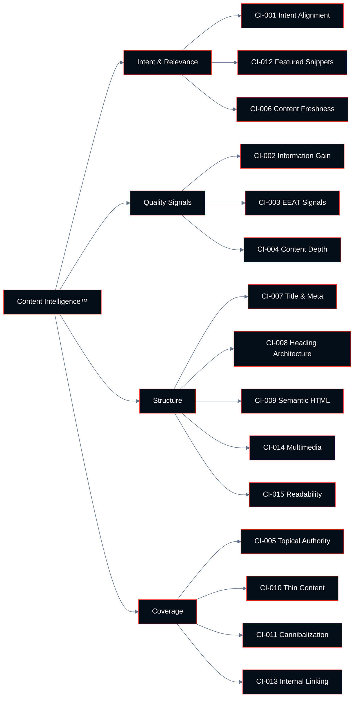

# Chapter 03: Content Intelligence™

**Growth AI SEO Audit Framework™**
Version 1.0.0 — Technocrats Digimate Pvt. Ltd.

---

## Pillar Overview

**Pillar:** Content Intelligence™
**Weight in Growth AI Score™:** 18%
**Checkpoint range:** CI-001 – CI-015
**Total checkpoints:** 15
**Maximum pillar score:** 45 (15 checkpoints × 3 points)

Content Intelligence™ evaluates whether a site's content meets the quality, intent alignment, and information standards that Google's ranking systems reward. It is the second-highest weighted pillar because, after technical accessibility, content quality is the most significant determinant of whether a page earns and sustains a search ranking.

This pillar does not evaluate content volume or keyword frequency. It evaluates content quality, intent alignment, information gain, and structural integrity — the factors that determine whether a page genuinely serves the user who arrives from a search.

---

## Architecture



---

## Checkpoint Index

| ID | Checkpoint | Domain | Priority if Failing |
|----|-----------|--------|---------------------|
| CI-001 | Search intent alignment | Intent | Critical |
| CI-002 | Information gain and originality | Quality | High |
| CI-003 | EEAT signal implementation | Quality | High |
| CI-004 | Content depth and comprehensiveness | Quality | High |
| CI-005 | Topical authority and coverage | Coverage | High |
| CI-006 | Content freshness and accuracy | Intent | Medium |
| CI-007 | Title and meta description quality | Structure | High |
| CI-008 | Heading architecture | Structure | Medium |
| CI-009 | Semantic HTML structure | Structure | Medium |
| CI-010 | Thin and duplicate content audit | Coverage | High |
| CI-011 | Content cannibalization | Coverage | High |
| CI-012 | Featured snippet optimization | Intent | Medium |
| CI-013 | Internal content linking | Coverage | Medium |
| CI-014 | Multimedia content optimization | Structure | Low |
| CI-015 | Content accessibility and readability | Structure | Medium |

---

## CI-001: Search Intent Alignment

**ID:** CI-001 | **Priority if Failing:** Critical

### Objective

Evaluate whether the primary content of each key page correctly matches the dominant search intent expressed by the queries that page targets.

### Business Importance

Intent mismatch is the most common reason that well-optimized pages fail to sustain rankings. A page that technically ranks for a query but does not satisfy the intent behind that query will accumulate poor engagement signals over time, causing ranking erosion.

### Google Search Importance

Google's ranking systems are extensively trained to match queries to content that satisfies the intent behind them, not just the literal words. Google documents this under the concept of "understanding user needs" in its Quality Rater Guidelines.

### AI Search Importance

AI Overviews and other AI search products select sources based on their ability to provide a clear, direct answer. Content that satisfies informational intent in a well-structured way is more likely to be cited than content that is optimized around keywords without directly addressing the question.

### The Four Intent Categories in Practice

**Informational intent** content requirements:
- Directly answers the question stated in the query
- Provides sufficient context for the user to understand without prior knowledge
- Anticipates and addresses follow-up questions
- Does not lead with a sales message

**Commercial investigation intent** content requirements:
- Compares options objectively
- Includes evaluative criteria that help users make decisions
- Is written from the user's perspective, not the vendor's
- Cites specific, verifiable product or service attributes

**Transactional intent** content requirements:
- Enables the action directly (purchase, contact, sign up)
- Minimizes friction between arrival and conversion
- Provides trust signals appropriate to the transaction
- Does not require users to read through informational content to reach the conversion point

**Navigational intent** content requirements:
- The destination page itself is the content
- Navigation structure makes the correct destination immediately accessible

### Step-by-Step Audit Procedure

**Step 1: Identify target pages**

From Search Console, identify the top 50 pages by organic impressions. These are the highest-priority pages for intent alignment evaluation.

**Step 2: Identify primary queries**

For each target page, identify the primary query (the query with highest impressions or clicks). This represents the dominant intent the page needs to satisfy.

**Step 3: Determine intent type**

Classify the primary query's intent: informational, navigational, commercial investigation, or transactional.

**Step 4: Evaluate page content against intent**

Assess whether the page content matches the intent type:
- Does the content type match? (Guide for informational, comparison for commercial investigation, etc.)
- Does the page lead with the intent-satisfying content?
- Does the page structure guide the user toward their goal?

**Step 5: Review SERP composition**

Compare the target page against pages currently ranking in positions 1–3 for the primary query. If the top-ranking pages are a different content type than the evaluated page, that is a strong signal of intent mismatch.

### Passing Criteria

- The primary content type matches the dominant intent of the primary query
- The page structure leads with intent-satisfying content
- The evaluated page is of a similar content type to pages currently ranking in positions 1–3

### Failure Indicators

- Product page ranking for an informational query
- Blog post ranking for a transactional query
- Content leads with marketing language when users are in informational intent mode
- Page requires more than two clicks to reach the primary intent-satisfying content

---

## CI-002: Information Gain and Originality

**ID:** CI-002 | **Priority if Failing:** High

### Objective

Evaluate whether each key piece of content adds information, perspective, or value that is not already available in the top-ranking results for the same queries.

### Business Importance

Content with no information gain beyond existing results has no durable ranking advantage. As Google's quality assessment systems become more sophisticated, content that merely restates existing information becomes increasingly unlikely to displace well-established pages.

### Google Search Importance

Google has documented information gain as a signal in research publications. The documentation frames it as: content that provides information the user could not have obtained from existing results has higher value than content that provides the same information in different words.

### Sources of Genuine Information Gain

- **Original research:** Surveys, studies, experiments, or analyses conducted by the publishing organization
- **First-hand experience:** Content that can only be written by someone who has done the thing being described
- **Expert synthesis:** Analysis that draws on domain expertise to connect ideas that existing content treats separately
- **Novel perspective:** A well-argued position on a contested topic that is not already represented in existing content
- **Data recency:** Fresher data than competing content in topics where recency matters
- **Audience specificity:** More detailed information than available elsewhere for a specific audience segment

### Step-by-Step Audit Procedure

**Step 1: Identify candidate pages for review**

Select key informational pages where content quality is the primary ranking lever.

**Step 2: Review top-ranking competitors**

Read the top three results for the primary query. Identify the key claims, information types, and structural approaches represented.

**Step 3: Assess differential value**

Determine what the evaluated page offers that the top three results do not.

**Step 4: Score information gain**

- High information gain: Contains original data, unique expert perspective, or substantively different information
- Medium information gain: Better organized or more thorough treatment of the same information
- Low information gain: Same information as existing results with no material difference

### Passing Criteria

- Key informational pages contain at least one element not present in top-ranking competitors: original data, unique expert perspective, or structural advantage
- No key content pages are direct rewrites of competing content

---

## CI-003: EEAT Signal Implementation

**ID:** CI-003 | **Priority if Failing:** High

### Objective

Evaluate whether the site and its content demonstrate Experience, Expertise, Authoritativeness, and Trustworthiness through observable, verifiable signals.

### EEAT Signals by Category

**Experience signals:**
- Bylined content with first-person experience narrative
- Case studies and examples from direct work
- Product reviews including specific usage context
- Before/after documentation

**Expertise signals:**
- Author bio pages with credentials and professional history
- Published works, speaking engagements, or media citations
- Professional affiliations and organizational memberships
- Expert attributions in content (quoting recognized specialists)

**Authoritativeness signals:**
- Links from authoritative publications in the same field
- Coverage in mainstream media
- Awards, certifications, or industry recognition
- Reviews and testimonials from recognized figures in the field

**Trustworthiness signals:**
- Accurate and complete contact information
- Clear ownership and About page
- Transparent privacy policy and terms of service
- Disclosure of commercial relationships (affiliate relationships, sponsored content)
- Factual accuracy and correction policy
- Secure HTTPS connection

### EEAT Evaluation by Site Type

**Your Money or Your Life (YMYL) sites** (medical, financial, legal, news) require the highest EEAT standards. Google's Quality Rater Guidelines apply stricter scrutiny to these categories.

**E-commerce sites** must demonstrate trustworthiness signals (secure checkout, return policy, contact information) and experiential signals (product reviews from verified buyers).

**B2B and professional services sites** require expertise signals (team credentials, case studies) and authoritativeness signals (industry recognition, client testimonials from named organizations).

### Passing Criteria

- All major content pages have identified authors with bios demonstrating relevant expertise
- Contact information is accurate, complete, and easily accessible
- Organizational information (About page, legal entity information) is present and accurate
- No content makes unverified claims in YMYL categories

---

## CI-004: Content Depth and Comprehensiveness

**ID:** CI-004 | **Priority if Failing:** High

### Objective

Evaluate whether key pages address the topic with sufficient depth to comprehensively satisfy the user's need without requiring them to visit additional sources.

### What Depth Means

Content depth is not a function of word count. It is a function of whether the content addresses:

- The primary question or task the user arrived with
- The natural follow-up questions that arise after the primary question is answered
- The context required to make the primary answer useful
- The practical implementation or next steps after understanding the primary topic

Content that is long but does not address these dimensions is not deep content. Content that is concise but addresses all four dimensions is appropriately deep.

### Step-by-Step Audit Procedure

**Step 1: Map the user need**

For each key page, articulate the complete user need: what they want to understand or accomplish, what they need to know to get there, and what they would do with the information.

**Step 2: Evaluate coverage**

Assess whether the page covers the full scope of the user need. Identify gaps: subtopics not addressed, questions raised but not answered, context not provided.

**Step 3: Compare with competitor coverage**

Review top-ranking competitors for the same query to identify topics they cover that the evaluated page does not.

**Step 4: Identify superfluous content**

Identify content that does not contribute to the user's need — introductory paragraphs that restate the query, boilerplate sections that appear on every page, content added for length rather than value.

### Passing Criteria

- Key pages address the full scope of the user need for the primary query
- No material subtopics are missing from high-priority pages
- No significant word count is consumed by content that does not serve the user's primary need

---

## CI-005: Topical Authority and Coverage

**ID:** CI-005 | **Priority if Failing:** High

### Objective

Evaluate whether the site has achieved sufficient content coverage across its core topic areas to be recognized as a topical authority.

### What Topical Authority Requires

A site develops topical authority in a subject area when:

1. It covers the main topic with comprehensive depth
2. It covers all significant subtopics with dedicated, quality content
3. Its coverage is internally linked in a way that connects related content
4. External sources link to its content as a reference on the topic

### Step-by-Step Audit Procedure

**Step 1: Define the site's core topic areas**

Identify the two to five core topic areas the site is trying to be authoritative on, based on business objectives and existing content.

**Step 2: Map topic coverage**

For each core topic, map the subtopics that a comprehensive resource would cover. This creates a content map.

**Step 3: Audit existing content against the content map**

Identify which subtopics have dedicated content, which have partial coverage, and which have no coverage.

**Step 4: Identify competitive gaps**

Review the top-ranking sites in each topic area. Identify subtopics they cover that the evaluated site does not.

### Passing Criteria

- Core topic areas have at least 70% coverage of the content map
- Key subtopics have dedicated, high-quality pages rather than being addressed only in passing within broader pages
- Content map has a clear internal linking structure

---

## CI-006: Content Freshness and Accuracy

**ID:** CI-006 | **Priority if Failing:** Medium

### Objective

Evaluate whether time-sensitive content is maintained with accurate, current information, and whether the site has a process for identifying and updating stale content.

### Freshness Importance by Content Type

- **High freshness requirement:** News, current events, pricing, statistics, legal requirements, software documentation
- **Medium freshness requirement:** Industry best practices, product comparisons, how-to guides
- **Low freshness requirement:** Foundational concept explanations, historical content, evergreen guides

### Passing Criteria

- Time-sensitive content includes publication and last-updated dates
- Statistics and data points reference their sources with dates
- No major content pages contain information that is demonstrably outdated
- Site has an identifiable content review process for high-freshness pages

---

## CI-007: Title and Meta Description Quality

**ID:** CI-007 | **Priority if Failing:** High

### Objective

Evaluate whether page titles and meta descriptions accurately represent page content, are optimized for click-through rate, and conform to display specifications.

### Title Tag Standards

- 50–60 characters is the recommended working range (longer titles may be truncated in results)
- Primary topic keyword included near the beginning
- Unique per page — no duplicate titles across the site
- Accurately represents the page content
- Differentiates from competing page titles in the same SERP

### Meta Description Standards

- 120–158 characters is the recommended working range
- Describes what the user will find on the page
- Includes a natural reason to click (benefit or outcome)
- Does not duplicate the title
- Is unique per page

### Step-by-Step Audit Procedure

**Step 1: Export all titles and meta descriptions**

From crawl data, export all page titles and meta descriptions.

**Step 2: Identify technical issues**

Flag: missing titles, duplicate titles, titles over 60 characters, missing meta descriptions, duplicate meta descriptions.

**Step 3: Assess quality**

For key pages, evaluate whether titles and descriptions match intent, are compelling, and differentiate from competitors.

**Step 4: Review Google's rewrites**

In Search Console Performance data, identify queries where the displayed title in search results differs from the declared title — this indicates Google is rewriting, often because the declared title is not sufficiently descriptive.

### Passing Criteria

- All indexable pages have unique, accurate titles within the recommended character range
- All key pages have meta descriptions within the recommended character range
- Fewer than 10% of titles are being rewritten by Google based on Search Console observation

---

## CI-008: Heading Architecture

**ID:** CI-008 | **Priority if Failing:** Medium

### Objective

Verify that heading tags (H1–H4) are used to create a logical document hierarchy that communicates page structure to both users and search engines.

### Heading Best Practices

- One H1 per page — the primary topic of the page
- H2 headings for major sections
- H3 headings for subsections within H2 sections
- No heading levels skipped (H1 → H3, skipping H2)
- Headings describe the content of the section, not styled as decorative elements
- Headings contain the language users would use when searching for the content in that section

### Passing Criteria

- One H1 per page on all indexable pages
- Logical hierarchy (H1 → H2 → H3) without gaps
- No headings used for purely decorative styling
- Key target queries represented in H1 or H2 headings on relevant pages

---

## CI-009: Semantic HTML Structure

**ID:** CI-009 | **Priority if Failing:** Medium

### Objective

Evaluate whether the site uses semantic HTML elements that communicate content structure and meaning to search engine parsers and assistive technologies.

### Key Semantic Elements

- `<article>` — self-contained content units
- `<section>` — thematically grouped content
- `<nav>` — navigation elements
- `<header>` / `<footer>` — page or section headers and footers
- `<main>` — the primary content area
- `<aside>` — supplementary content
- `<figure>` / `<figcaption>` — media with captions
- `<time>` — date and time values
- `<address>` — contact information

### Passing Criteria

- `<main>` element identifies the primary content area
- Navigation elements use `<nav>`
- Article content uses `<article>` element
- `<div>` is not used for semantic purposes where semantic elements exist

---

## CI-010: Thin and Duplicate Content Audit

**ID:** CI-010 | **Priority if Failing:** High

### Objective

Identify pages with insufficient content to satisfy any user need (thin content) and pages with content substantially duplicated across multiple URLs.

### Thin Content Categories

- Auto-generated pages with no editorial content
- Affiliate pages with manufacturer content and no original value-add
- Category or tag pages with only a list of links and no editorial content
- Location pages generated from a template with only city name changed
- Boilerplate pages with extensive legal or navigation content and minimal unique content

### Passing Criteria

- No pages in the index contain fewer than 300 words of unique, valuable content
- No page content is substantially duplicated on another URL without canonical consolidation
- Auto-generated pages with no unique content are either removed, consolidated, or noindexed

---

## CI-011: Content Cannibalization

**ID:** CI-011 | **Priority if Failing:** High

### Objective

Identify cases where multiple pages on the same site target the same or highly overlapping queries, causing them to compete against each other in search results.

### Business Importance

Cannibalization disperses authority across multiple pages, reducing the ranking potential of each. A site with one authoritative page on a topic will typically outperform a site with three competing pages on the same topic.

### Step-by-Step Audit Procedure

**Step 1: Export query-level data from Search Console**

For each query, identify how many different pages are ranking. When the same query shows multiple different pages across different date ranges, cannibalization may be occurring.

**Step 2: Identify cannibalization clusters**

Group pages by shared target query. Any cluster with more than one page targeting the same primary query is a cannibalization candidate.

**Step 3: Evaluate each cluster**

Determine whether the pages serve genuinely different intents or are competing for the same traffic.

**Step 4: Recommend consolidation or differentiation**

For genuine cannibalization: consolidate pages, redirect weaker pages to stronger pages, or clearly differentiate intent and targeting.

### Passing Criteria

- No cluster of two or more pages targeting the same primary query exists without clear intent differentiation
- Search Console does not show rank switching between multiple pages for the same high-value queries

---

## CI-012: Featured Snippet Optimization

**ID:** CI-012 | **Priority if Failing:** Medium

### Objective

Evaluate whether key pages are structured to capture featured snippet positions for high-value queries.

### Featured Snippet Types and Corresponding Content Structure

**Paragraph snippets (most common):**
- Question stated in a heading immediately above a direct, concise answer
- Answer is 40–60 words
- Plain language

**List snippets:**
- Step-by-step processes in ordered lists
- Attribute comparisons in unordered lists
- Lists of 5–10 items

**Table snippets:**
- Data presented in HTML `<table>` elements
- 3–5 rows and columns is optimal

### Passing Criteria

- Key pages targeting question-based queries include a direct, concise answer near the top
- Process content uses numbered lists
- Comparison content uses tables

---

## CI-013: Internal Content Linking

**ID:** CI-013 | **Priority if Failing:** Medium

### Objective

Evaluate the quality and quantity of contextual internal links between content pages, which distribute authority and guide users to related content.

### Distinction from TI-012

TI-012 (Internal Link Architecture) evaluates structural linking — navigational links, orphan pages, click depth, and redirect integrity. CI-013 evaluates contextual linking — the editorial links within body copy that connect related content.

### Passing Criteria

- Key content pages include contextual links to related pages using descriptive anchor text
- Content clusters (related topic pages) are fully interlinked
- No content page has zero internal links from other content pages

---

## CI-014: Multimedia Content Optimization

**ID:** CI-014 | **Priority if Failing:** Low

### Objective

Evaluate whether images, videos, and other media are optimized for search discovery and do not impede page performance.

### Key Checks

- Images have descriptive `alt` attributes
- Image file names are descriptive (not `IMG_0042.jpg`)
- Images are served in modern formats (WebP or AVIF)
- Videos have transcripts or captions
- Video content is marked up with VideoObject schema
- Images and videos are included in a media sitemap

---

## CI-015: Content Accessibility and Readability

**ID:** CI-015 | **Priority if Failing:** Medium

### Objective

Evaluate whether content is written and structured in a way that is accessible to the full range of intended users, including those using assistive technologies.

### Key Checks

- Reading level appropriate to the intended audience
- No jargon without explanation for general-audience content
- Short paragraphs (3–5 sentences) in most cases
- Active voice used predominantly
- Text has sufficient contrast against background (WCAG 4.5:1 minimum for normal text)
- Content does not depend on color alone to convey meaning

---

## Pillar Scoring Summary

When all 15 Content Intelligence™ checkpoints have been evaluated:

```
Content Pillar Score = (Sum of checkpoint scores / 45) × 100
```

Record all scores in the Content Scorecard (`/scorecards/content-scorecard.md`).

For the composite Growth AI Score™, the Content Pillar Score is multiplied by 0.18 (its 18% weight).

---

*Next: [04-entity-intelligence.md](04-entity-intelligence.md) — Entity Intelligence™ pillar*
