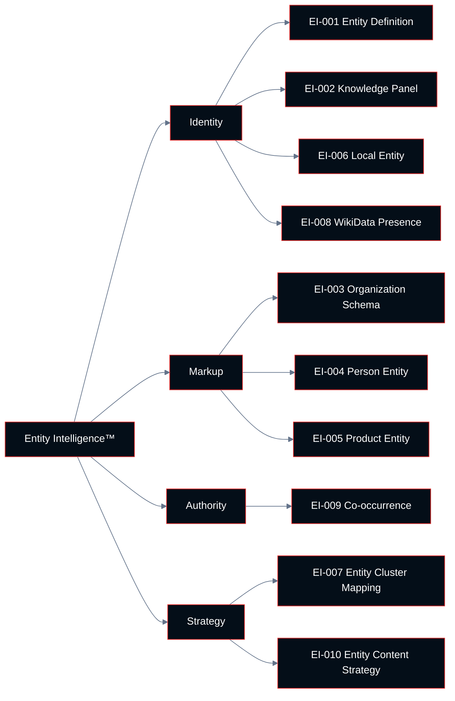

# Chapter 04: Entity Intelligence™

**Growth AI SEO Audit Framework™**
Version 1.0.0 — Technocrats Digimate Pvt. Ltd.

---

## Pillar Overview

**Pillar:** Entity Intelligence™
**Weight in Growth AI Score™:** 10%
**Checkpoint range:** EI-001 – EI-010
**Total checkpoints:** 10
**Maximum pillar score:** 30 (10 checkpoints × 3 points)

Entity Intelligence™ evaluates how well a web property is recognized, understood, and connected within Google's Knowledge Graph. Modern search engines do not merely match keywords — they understand the world through entities: named things (people, organizations, products, places, concepts) and the relationships between them.

A site that is clearly associated with the right entities — its own organizational identity, its key products and services, its topical domain — benefits from Google's contextual understanding in ways that keyword-only optimization cannot replicate. This includes improved recognition for topically related queries that are not directly targeted, citation inclusion in AI-generated answers, and Knowledge Panel visibility.

---

## What Is an Entity?

An entity is any thing that can be distinguished from other things and given a unique identity. In the context of Google's Knowledge Graph:

- **Organizations:** Technocrats Digimate Pvt. Ltd., Google LLC
- **People:** Gautam Punj, Sundar Pichai
- **Products:** iPhone 16 Pro, HubSpot Marketing Hub
- **Places:** Mumbai, Bengaluru
- **Concepts:** SEO, machine learning, entity resolution
- **Events:** Google I/O 2025, IPL 2025

Google maintains a database of entities and the relationships between them (the Knowledge Graph). When a web property is clearly associated with specific entities, Google can use that association to:

- Understand what the site is about without relying only on keyword signals
- Rank the site for queries related to its entities even when specific keywords are not present
- Display Knowledge Panel results for brand queries
- Include the site's content in AI-generated answers about its associated entities

---

## Architecture



---

## Checkpoint Index

| ID | Checkpoint | Domain | Priority if Failing |
|----|-----------|--------|---------------------|
| EI-001 | Entity definition and disambiguation | Identity | High |
| EI-002 | Knowledge Panel presence | Identity | Medium |
| EI-003 | Organization schema implementation | Markup | High |
| EI-004 | Person entity optimization | Markup | Medium |
| EI-005 | Product and service entity markup | Markup | Medium |
| EI-006 | Local entity and NAP consistency | Identity | High |
| EI-007 | Topical entity cluster mapping | Strategy | High |
| EI-008 | WikiData and Wikipedia presence | Authority | Medium |
| EI-009 | Co-occurrence and entity association | Authority | Medium |
| EI-010 | Entity-based content strategy | Strategy | Medium |

---

## EI-001: Entity Definition and Disambiguation

**ID:** EI-001 | **Priority if Failing:** High

### Objective

Verify that the site clearly defines its organizational entity, disambiguates it from other entities with similar names, and provides consistent entity signals across all owned web properties.

### Business Importance

Without clear entity definition, Google may associate the site with the wrong entity (a different company with a similar name) or fail to build a strong entity association at all. Entity confusion is common for businesses with generic names, businesses in crowded markets, or businesses with the same name as other entities.

### Entity Disambiguation Signals

To establish clear entity identity, a site should provide:

- **Consistent NAP (Name, Address, Phone):** The same business name, address, and phone number across all pages, directories, and profiles
- **Sameoas links in schema:** Explicit links to the organization's profiles on authoritative third-party sources (LinkedIn, Wikipedia, Wikidata, official business directories)
- **Consistent brand name:** No variations in capitalization, punctuation, or abbreviation across the site
- **Clear About page:** A page that unambiguously describes the organization, its history, location, and purpose
- **Author entities:** Clear association between people (authors, executives) and the organization

### Step-by-Step Audit Procedure

**Step 1: Audit brand name consistency**

Search Google for the brand name. Identify all properties that appear in results. Check that the brand name is spelled and formatted identically across all of them.

**Step 2: Audit sameAs connections**

Review the Organization schema on the site's homepage. Identify all `sameAs` URLs listed. Verify that each URL resolves to an active profile that represents the same organization.

**Step 3: Check for entity disambiguation issues**

Search Google for `"[brand name]"` to identify whether Google associates the brand name with the correct entity or returns results for a different entity with a similar name.

**Step 4: Review About page content**

Evaluate the About page for completeness: founding date, location, legal entity name, industry, key personnel, and mission.

### Passing Criteria

- Organization schema includes accurate `sameAs` links to at least three authoritative third-party profiles
- Brand name is spelled and formatted identically across all evaluated properties
- About page provides clear, accurate organizational information
- Google search for brand name returns the correct entity in top results

---

## EI-002: Knowledge Panel Presence

**ID:** EI-002 | **Priority if Failing:** Medium

### Objective

Evaluate whether the organization has a Google Knowledge Panel and whether the information in the panel is accurate and complete.

### Business Importance

A Knowledge Panel indicates that Google has added the organization to its Knowledge Graph as a recognized entity. This has direct implications for AI Overviews inclusion and brand SERP appearance.

### What a Knowledge Panel Indicates

A Knowledge Panel appears when Google has sufficient confidence that:
1. The entity is notable enough to warrant an entry
2. The information sources are sufficiently consistent and authoritative
3. The entity can be disambiguated from other entities

Not all organizations have Knowledge Panels. Knowledge Panels are typically available to organizations with Wikipedia pages, significant media coverage, or strong structured data signals across multiple authoritative sources.

### Step-by-Step Audit Procedure

**Step 1: Search for the brand Knowledge Panel**

Search Google for the exact brand name. Check whether a Knowledge Panel appears on the right side of desktop results or at the top of mobile results.

**Step 2: Evaluate panel completeness**

If a panel exists, check for: organization description, website URL, logo, social media profiles, founded date, headquarters location.

**Step 3: Check for inaccuracies**

Identify any panel information that is incorrect or outdated. Document for correction via Google's feedback mechanisms.

**Step 4: If no panel exists, assess eligibility**

Evaluate what is needed to establish a Knowledge Panel:
- Wikidata entity presence
- Wikipedia page (if notable enough)
- Consistent sameAs signals across the web
- Search Console verification as official representative

### Passing Criteria

- Knowledge Panel exists for the organization
- Panel information is accurate and complete
- Organization has claimed the Knowledge Panel via Search Console verification

---

## EI-003: Organization Schema Implementation

**ID:** EI-003 | **Priority if Failing:** High

### Objective

Verify that Organization schema (or its subtypes) is correctly implemented on the site's homepage and key pages, with all required and recommended properties populated.

### Organization Schema Requirements

The following properties are required or strongly recommended:

| Property | Requirement | Example |
|----------|-------------|---------|
| `@type` | Required | `Organization` |
| `name` | Required | `"Technocrats Digimate Pvt. Ltd."` |
| `url` | Required | `"https://technocratsdigimate.com"` |
| `logo` | Recommended | URL to logo image |
| `sameAs` | Strongly recommended | Array of profile URLs |
| `contactPoint` | Recommended | Contact information |
| `address` | Recommended for local businesses | PostalAddress |
| `foundingDate` | Optional | `"2020"` |
| `description` | Recommended | Short organizational description |

### Implementation Standards

- Implement in JSON-LD format (preferred by Google)
- Place in the `<head>` of the homepage
- Use the most specific subtype applicable: `LocalBusiness`, `Corporation`, `NGO`, etc.
- Validate with Google's Rich Results Test

### Step-by-Step Audit Procedure

**Step 1: Check homepage for Organization schema**

Inspect the homepage source for `@type: "Organization"` or a subtype in JSON-LD format.

**Step 2: Validate schema properties**

Check that required properties are present and populated with accurate data.

**Step 3: Validate sameAs array**

Test each sameAs URL to confirm it resolves and represents the same organization.

**Step 4: Run Rich Results Test**

Validate the implementation for errors and warnings.

### Passing Criteria

- Organization schema present on homepage in JSON-LD format
- All required properties populated with accurate data
- At least three sameAs links to active, relevant profiles
- No validation errors in Rich Results Test

---

## EI-004: Person Entity Optimization

**ID:** EI-004 | **Priority if Failing:** Medium

### Objective

Evaluate whether key individuals (authors, executives, founders) are established as recognized entities with clear connections to the organization.

### Business Importance

Person entities contribute to EEAT signals. When Google recognizes an author as an expert in a specific domain, content written by that author may benefit from the author's entity authority. This is particularly important for YMYL content.

### Person Entity Signals

- Author bio page with schema markup (`@type: "Person"`)
- `sameAs` links on author bio: LinkedIn, professional profiles, Wikipedia (if applicable)
- Consistent author attribution across all content
- Person linked to organization via `worksFor` or `memberOf` property
- External mentions and citations of the person in relevant publications

### Passing Criteria

- Key authors have dedicated author bio pages with Person schema
- Author bio pages include sameAs links to professional profiles
- Author attribution is consistent across all authored content
- Authors' bylines appear on all authored content pages

---

## EI-005: Product and Service Entity Markup

**ID:** EI-005 | **Priority if Failing:** Medium

### Objective

Evaluate whether key products and services are marked up with appropriate schema types that communicate their properties and relationships to Google.

### Applicable Schema Types

- `Product` — for physical or digital products
- `Service` — for service offerings
- `SoftwareApplication` — for software products
- `Course` — for educational offerings
- `Event` — for events

### Key Product Schema Properties

| Property | Description |
|----------|-------------|
| `name` | Product name |
| `description` | Product description |
| `image` | Product image URL |
| `offers` | Pricing information (Offer schema) |
| `aggregateRating` | Overall rating from reviews |
| `brand` | Manufacturer or brand |
| `sku` | Stock keeping unit identifier |

### Passing Criteria

- All key products and services have appropriate schema markup
- Offer information (pricing) included where applicable and accurate
- AggregateRating included for products with genuine review data
- No schema properties contain information that does not appear on the page

---

## EI-006: Local Entity and NAP Consistency

**ID:** EI-006 | **Priority if Failing:** High
**Applicable:** Businesses with physical locations

### Objective

Evaluate the consistency of business Name, Address, and Phone (NAP) information across the website and major third-party directories, and verify that Google Business Profile is optimized.

### Business Importance

NAP consistency across the web is a primary trust signal for local search rankings. Inconsistent NAP information — different phone numbers, address formats, or business names across directories — sends conflicting entity signals to Google.

### Key Directories to Audit

Tier 1 (highest authority):
- Google Business Profile
- Apple Maps (Apple Business Connect)
- Bing Places

Tier 2:
- Yelp
- Facebook Business Page
- LinkedIn Company Page
- Industry-specific directories

### Step-by-Step Audit Procedure

**Step 1: Establish canonical NAP**

Confirm the official, canonical business name, address, and phone number from the business's legal documentation.

**Step 2: Audit website NAP**

Check the website's contact page, footer, and About page for NAP information. Confirm it matches the canonical.

**Step 3: Audit third-party directories**

Search for the business on all Tier 1 and Tier 2 directories. Record NAP information from each and compare with canonical.

**Step 4: Audit Google Business Profile**

Review the complete Google Business Profile for: name accuracy, address, phone, website URL, hours, categories, photos, and review responses.

### Passing Criteria

- NAP is identical across all Tier 1 directories and the website
- No more than 10% variation in NAP formatting across Tier 2 directories
- Google Business Profile is complete, verified, and actively maintained
- LocalBusiness schema on website matches Google Business Profile information

---

## EI-007: Topical Entity Cluster Mapping

**ID:** EI-007 | **Priority if Failing:** High

### Objective

Map the entities that the site's content is associated with, and evaluate whether those entity associations align with the site's intended topical authority.

### Entity Cluster Concept

A topical entity cluster is a group of entities that are semantically related and collectively define a subject domain. For a digital marketing agency, the cluster might include: SEO, Google Ads, content marketing, web analytics, conversion optimization, landing pages.

When a site consistently publishes content that mentions and contextualizes these entities in relation to each other, Google builds an association between the site and the cluster. This association strengthens ranking for queries related to any entity in the cluster.

### Step-by-Step Audit Procedure

**Step 1: Identify the site's intended topic domain**

Based on business objectives, define the two to five topic areas the site should be authoritative on.

**Step 2: Map entities to topic domain**

For each topic area, list the key entities (concepts, products, people, organizations) that define that domain.

**Step 3: Audit content for entity presence**

Review key content pages. Identify which domain entities are mentioned and contextualized in the content.

**Step 4: Identify entity gaps**

Find entities that are important to the domain but absent or underrepresented in the site's content.

### Passing Criteria

- Site's content consistently references and contextualizes the key entities in its intended topic domains
- No major entities in the site's intended domain are absent from the content

---

## EI-008: WikiData and Wikipedia Presence

**ID:** EI-008 | **Priority if Failing:** Medium

### Objective

Evaluate whether the organization has a Wikidata entity and, where notability criteria are met, a Wikipedia article.

### Business Importance

Wikidata is the structured data layer that Google's Knowledge Graph draws from. An organization with a Wikidata entry — even without a Wikipedia article — has a cleaner entity signal than one without. Wikipedia presence significantly strengthens the entity and provides high-authority sameAs links.

### Wikidata vs. Wikipedia

**Wikidata:** A free knowledge base that can be edited by any user. Any organization can have a Wikidata entry regardless of notability. The entry should include: official name, country, industry, website URL, inception date, and official social media accounts.

**Wikipedia:** An encyclopedia with notability requirements. Organizations must meet Wikipedia's notability standards (substantial coverage in reliable, independent sources) to have a Wikipedia article.

### Passing Criteria

- Organization has a Wikidata entry with accurate, complete information
- If notable (by Wikipedia standards), a Wikipedia article exists and is accurate
- Organization schema includes `sameAs` link to Wikidata entity
- Wikipedia article (if it exists) is accurate and not flagged for deletion

---

## EI-009: Co-occurrence and Entity Association

**ID:** EI-009 | **Priority if Failing:** Medium

### Objective

Evaluate whether the organization is co-mentioned with the correct entities (industry peers, topic domains, authoritative sources) across the web in a pattern that strengthens its entity associations.

### What Co-occurrence Signals

When a site or brand is repeatedly mentioned in the same context as specific entities — other companies in the same industry, specific topic keywords, recognized experts — Google builds an association between the mentioned entity and those co-occurring entities. This is a signal that the brand belongs in that context.

### Audit Approach

**Step 1: Search for brand mentions**

Use advanced search operators and brand monitoring tools to find web pages that mention the brand name.

**Step 2: Analyze co-occurring entities**

In a sample of brand mentions, identify what other entities are mentioned in the same content. Are these entities relevant to the brand's intended domain?

**Step 3: Assess association quality**

Distinguish between high-quality co-occurrence (industry publication mentioning the brand alongside relevant peers) and low-quality co-occurrence (link directory listing with no topical context).

### Passing Criteria

- Brand is mentioned in context with relevant industry peers and topic entities in majority of sampled co-occurrence instances
- No significant negative co-occurrence (brand associated with spam, controversy, or unrelated topics)

---

## EI-010: Entity-Based Content Strategy

**ID:** EI-010 | **Priority if Failing:** Medium

### Objective

Evaluate whether the site's content strategy is structured around entity building — creating content that establishes and reinforces entity associations — rather than purely keyword-based targeting.

### Entity-Based Content vs. Keyword-Based Content

| Dimension | Keyword-Based | Entity-Based |
|-----------|--------------|--------------|
| Primary target | Search query string | Topic entity |
| Content scope | Single query page | Entity coverage cluster |
| Success measure | Ranking for target keyword | Ranking for all related queries |
| Internal linking | Ad hoc | Entity cluster interconnection |
| External goals | Backlinks to page | Citations of the entity |

### Passing Criteria

- Site has identifiable content clusters organized around core topic entities, not just individual keywords
- Content within clusters is interlinked in a way that reinforces entity associations
- Content strategy planning uses entity mapping as a primary input, not just keyword research

---

## Pillar Scoring Summary

When all 10 Entity Intelligence™ checkpoints have been evaluated:

```
Entity Pillar Score = (Sum of checkpoint scores / 30) × 100
```

Record all scores in the Entity Scorecard (`/scorecards/`).

For the composite Growth AI Score™, the Entity Pillar Score is multiplied by 0.10 (its 10% weight).

---

*Next: [05-authority-intelligence.md](05-authority-intelligence.md) — Authority Intelligence™ pillar*
