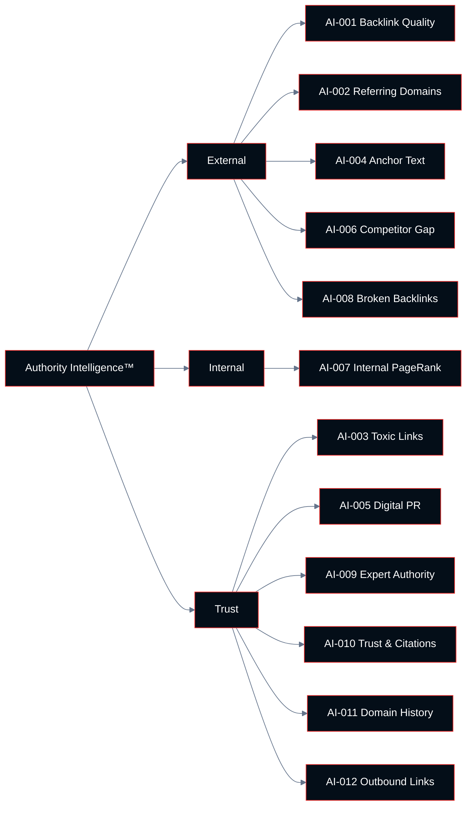

# Chapter 05: Authority Intelligence™

**Growth AI SEO Audit Framework™**
Version 1.0.0 — Technocrats Digimate Pvt. Ltd.

---

## Pillar Overview

**Pillar:** Authority Intelligence™
**Weight in Growth AI Score™:** 12%
**Checkpoint range:** AI-001 – AI-012
**Total checkpoints:** 12
**Maximum pillar score:** 36 (12 checkpoints × 3 points)

Authority Intelligence™ evaluates the external trust and authority signals that influence how Google weighs a site's content against competing content. While the precise mechanics of PageRank are proprietary and have evolved significantly from the original algorithm, external links remain a documented, significant ranking factor in Google's systems.

This pillar evaluates the quality, diversity, and health of the backlink profile, as well as the digital PR signals, expert authority attributions, and internal authority distribution that collectively determine a site's ranking strength on competitive queries.

---

## The Role of Authority in Modern Search

Authority signals matter most when content quality signals are approximately equal between competing pages. When two pages address the same topic with similar depth and intent alignment, the page with stronger authority signals will typically outrank the other.

Authority has three dimensions in this framework:

**External authority:** Links from other websites that pass ranking signals to the target site
**Internal authority:** The distribution of authority from high-authority pages to lower-authority pages within the same site
**Entity authority:** The recognition of the site's people and organization as authoritative in their domain, through citations, media coverage, and expert attributions

---

## Architecture



---

## Checkpoint Index

| ID | Checkpoint | Domain | Priority if Failing |
|----|-----------|--------|---------------------|
| AI-001 | Backlink profile quality | External | High |
| AI-002 | Referring domain diversity | External | High |
| AI-003 | Toxic link identification | Trust | High |
| AI-004 | Anchor text distribution | External | Medium |
| AI-005 | Digital PR and brand mention audit | Trust | Medium |
| AI-006 | Competitor link gap analysis | External | High |
| AI-007 | Internal PageRank distribution | Internal | High |
| AI-008 | Broken backlink recovery | External | Medium |
| AI-009 | Expert and author authority signals | Trust | Medium |
| AI-010 | Trust and citation signals | Trust | Medium |
| AI-011 | Domain history and manual actions | Trust | Critical |
| AI-012 | Outbound link quality | Trust | Low |

---

## AI-001: Backlink Profile Quality

**ID:** AI-001 | **Priority if Failing:** High

### Objective

Evaluate the overall quality of the site's backlink profile by assessing the authority, relevance, and editorial nature of referring pages.

### Business Importance

A strong backlink profile with high-quality referring pages provides the ranking authority that allows competitive performance on high-value queries. A weak or manipulated backlink profile either provides no authority benefit or actively risks penalties.

### Quality Dimensions

**Domain Authority:** The relative authority of the linking domain as estimated by third-party tools (Ahrefs Domain Rating, Moz Domain Authority, Semrush Authority Score). These are approximations, not Google metrics.

**Topical Relevance:** Whether the linking page discusses topics relevant to the linked content. A link from a gardening blog to a software company's pricing page has low topical relevance. A link from a marketing publication to an SEO guide has high topical relevance.

**Editorial Nature:** Whether the link was placed editorially — because the linking author chose to reference the content — versus commercially (paid) or artificially (link scheme). Editorial links carry full authority value.

**Link Placement:** Links within the body copy of a page typically carry more weight than links in footers, sidebars, or comment sections.

### Step-by-Step Audit Procedure

**Step 1: Export full backlink profile**

Use a backlink analysis tool (Ahrefs, Semrush, or Moz) to export all known backlinks. Export: linking domain, linking URL, target URL, anchor text, link type (dofollow/nofollow).

**Step 2: Segment by quality tier**

Classify referring domains into quality tiers:
- Tier 1: High-authority, topically relevant domains
- Tier 2: Medium-authority or topically adjacent domains
- Tier 3: Low-authority, irrelevant, or spammy domains

**Step 3: Calculate quality distribution**

Determine what percentage of the link profile falls into each tier. A healthy profile has the majority of links from Tier 1 and Tier 2.

**Step 4: Identify top-linked pages**

Identify which pages on the site receive the most referring domains. Evaluate whether these pages align with business priorities.

### Passing Criteria

- Majority of referring domains are topically relevant to the site's subject matter
- No evidence of link scheme participation (large volumes of footer links, comment spam, paid link networks)
- Top-linked pages align with commercial priorities or strategic content

---

## AI-002: Referring Domain Diversity

**ID:** AI-002 | **Priority if Failing:** High

### Objective

Evaluate the diversity of referring domains — the number of unique domains linking to the site — as a measure of the breadth of the authority signal.

### Why Diversity Matters

Ten links from ten different domains provide more authority signal than ten links from the same domain. A backlink profile with high referring domain diversity indicates that many independent sources consider the site a worthwhile reference, which is a stronger signal than multiple links from the same source.

### Benchmarks

Referring domain benchmarks vary substantially by industry, age of domain, and competitive context. The relevant measure is always relative to competitors, not absolute.

### Passing Criteria

- Referring domain count is competitive with or exceeding primary organic competitors
- No single domain accounts for more than 15% of the total link authority (measured by Ahrefs or equivalent)
- Referring domains are distributed across multiple IP ranges, hosting providers, and countries (where international scope is relevant)

---

## AI-003: Toxic Link Identification

**ID:** AI-003 | **Priority if Failing:** High

### Objective

Identify links from low-quality, spammy, or manipulative sources that may be suppressing the site's authority signals or creating penalty risk.

### Toxic Link Indicators

A link is potentially toxic when the linking domain exhibits:
- Very low authority scores with no discernible organic traffic
- Content unrelated to any subject matter (link farm patterns)
- Content in a language unrelated to the target site's market
- Excessive outbound link volume from a single page (link selling indicators)
- Domain name patterns associated with link schemes

### Step-by-Step Audit Procedure

**Step 1: Flag low-quality domains**

From the full backlink export, flag domains with authority score below a defined threshold (varies by tool; typically DR < 5 or DA < 5 combined with no organic traffic signal).

**Step 2: Sample and review**

Manually review a sample of flagged domains. Distinguish between genuinely harmful links (link farms, paid networks) and simply low-authority links that are still editorial (small blogs, local community sites).

**Step 3: Evaluate existing disavow file**

If a disavow file exists, review its contents. Verify that disavowed domains are genuinely harmful, not merely low-authority.

**Step 4: Determine disavow action**

For domains confirmed as harmful: add to disavow file if not already disavowed. Do not disavow editorial links from low-authority sources — only links that are unnatural.

### Passing Criteria

- No active manual action related to unnatural links in Search Console
- Proportion of clearly spammy or manipulative links is below 5% of referring domains
- Disavow file exists and is reviewed annually

---

## AI-004: Anchor Text Distribution

**ID:** AI-004 | **Priority if Failing:** Medium

### Objective

Evaluate the anchor text distribution of the backlink profile for naturalness and absence of over-optimization patterns.

### Natural vs. Over-Optimized Anchor Text

A natural backlink profile has a diverse anchor text distribution:
- Brand name: 25–40% of links
- URL/naked link: 15–25%
- Generic ("click here", "read more", "this article"): 10–20%
- Topically descriptive: 20–35%
- Exact-match keyword: typically under 5%

High concentrations of exact-match keyword anchor text — particularly for competitive commercial queries — is a historical link scheme signal that Google's algorithms have been trained to detect and discount or penalize.

### Passing Criteria

- Brand name is the most common anchor text category
- Exact-match commercial keyword anchors represent less than 5% of total anchors
- No single non-brand anchor text string accounts for more than 10% of total anchors

---

## AI-005: Digital PR and Brand Mention Audit

**ID:** AI-005 | **Priority if Failing:** Medium

### Objective

Identify brand mentions in media and industry publications, evaluate the quality of coverage, and identify unlinked mentions that represent link acquisition opportunities.

### Digital PR Evaluation Criteria

High-quality digital PR coverage:
- Placement in publications with genuine editorial standards
- Coverage that mentions the brand in a relevant, substantive context
- Coverage in publications that Google's systems associate with the site's topic domain

### Unlinked Mention Opportunity

An unlinked mention is a reference to the brand or a key piece of content on an external site that does not include a link. These represent the highest-probability link acquisition opportunity because:

- The author has already chosen to reference the brand or content
- Converting a mention to a link requires only a request, not a new editorial decision
- The link would be editorially genuine

### Passing Criteria

- Site has coverage in at least one recognized publication in its industry
- Unlinked mention inventory has been completed and outreach process initiated
- Brand mentions are predominantly positive or neutral in context

---

## AI-006: Competitor Link Gap Analysis

**ID:** AI-006 | **Priority if Failing:** High

### Objective

Identify referring domains that link to two or more primary competitors but do not link to the evaluated site — these represent realistic and prioritized link acquisition targets.

### Step-by-Step Audit Procedure

**Step 1: Identify primary competitors**

Select the two to four sites that consistently compete for the same high-value queries.

**Step 2: Export competitor backlink profiles**

Export the referring domain lists for each competitor using a backlink tool.

**Step 3: Identify gap domains**

Find domains that link to at least two competitors but not to the evaluated site. These domains have demonstrated willingness to link to content in this space.

**Step 4: Qualify gap domains**

Filter gap domains by authority, topical relevance, and real organic traffic. Prioritize high-authority, relevant domains.

**Step 5: Identify content that earned the links**

For each gap domain, identify which competing page earned the link. Determine whether the evaluated site has equivalent content that could earn the same link.

### Passing Criteria

- Link gap analysis completed for primary competitors
- Top link gap domains identified and prioritized for outreach
- Content gaps that are preventing link acquisition are identified and addressed in the content strategy

---

## AI-007: Internal PageRank Distribution

**ID:** AI-007 | **Priority if Failing:** High

### Objective

Evaluate how authority flows through the site's internal link structure and whether high-priority pages receive appropriate internal link equity.

### Business Importance

Internal links distribute authority earned from external links throughout the site. Pages with many internal links pointing to them receive more internal authority. By engineering internal linking to point toward high-priority pages, practitioners can improve the ranking potential of those pages without acquiring new external links.

### Step-by-Step Audit Procedure

**Step 1: Identify high-priority pages**

Define the 20–50 pages that are most important to business objectives (commercial pages, key content, primary landing pages).

**Step 2: Count internal links to high-priority pages**

From crawl data, count the number of internal links pointing to each high-priority page.

**Step 3: Compare with actual traffic distribution**

If high-priority pages receive fewer internal links than secondary or tertiary pages, authority is being misallocated.

**Step 4: Audit anchor text of internal links**

Confirm that internal links to key pages use descriptive, relevant anchor text that reinforces the page's topical focus.

### Passing Criteria

- Commercial priority pages receive the highest volumes of internal links after the homepage
- Internal links to key pages use descriptive, relevant anchor text
- No high-priority page has fewer than 5 internal links pointing to it

---

## AI-008: Broken Backlink Recovery

**ID:** AI-008 | **Priority if Failing:** Medium

### Objective

Identify external links pointing to URLs that no longer exist on the site (404 pages) and implement redirect recovery to reclaim the lost authority.

### Business Importance

When a page that has earned external links is deleted, moved, or renamed without a redirect, those external links begin returning 404 errors. The authority they carried is lost. Redirecting the dead URL to the most relevant current page reclaims that authority.

### Passing Criteria

- All URLs receiving external links return 200 or redirect to a 200 URL
- No high-authority external links are pointing to 404 pages
- Redirect mapping process exists for future page changes

---

## AI-009: Expert and Author Authority Signals

**ID:** AI-009 | **Priority if Failing:** Medium

### Objective

Evaluate whether the organization's people (authors, executives, subject matter experts) are recognized as authoritative in their domain through external signals.

### Author Authority Signals

- Published work in recognized industry publications (bylined articles, guest contributions)
- Speaking engagements at recognized industry events
- Citations by name in other authoritative content
- Academic or professional publications
- Podcast appearances or media interviews

### Passing Criteria

- Key authors and subject matter experts have verifiable third-party recognition in relevant publications or events
- External publications reference the organization's experts by name in relevant contexts
- Author profiles include links to or references of external recognition

---

## AI-010: Trust and Citation Signals

**ID:** AI-010 | **Priority if Failing:** Medium

### Objective

Evaluate the breadth and quality of factual citations to the site's content — citations in research, journalism, and authoritative references that signal trustworthiness beyond standard editorial links.

### Citation Signals

- References in academic or research papers
- Citations in government or NGO publications
- References in established media outlets
- Use of the site's data or research in other authoritative content

### Passing Criteria

- Site's original research or data has been cited by at least one authoritative external source
- Content that makes factual claims cites primary sources, making it credible enough to be cited in turn

---

## AI-011: Domain History and Manual Actions

**ID:** AI-011 | **Priority if Failing:** Critical

### Objective

Evaluate the domain's history for previous penalties, ownership changes, or historical spam activity that may be affecting current search performance.

### Step-by-Step Audit Procedure

**Step 1: Check Search Console for manual actions**

Review the Manual Actions section in Search Console. Any active manual action must be addressed before any other work can have meaningful effect.

**Step 2: Review domain history**

Use web archive tools to review the domain's historical content. Identify any periods of spam, unrelated content, or low-quality use.

**Step 3: Check domain history for previous penalty indicators**

Review historical rankings data for the domain. A sudden, significant ranking drop in the past may indicate a previous algorithmic or manual penalty.

**Step 4: Check ownership history**

If the domain was acquired, review the pre-acquisition backlink profile for toxic patterns inherited with the domain.

### Passing Criteria

- No active manual actions in Search Console
- No unexplained historical ranking drops suggestive of previous penalty
- No significant toxic backlink patterns inherited from a previous domain owner

---

## AI-012: Outbound Link Quality

**ID:** AI-012 | **Priority if Failing:** Low

### Objective

Evaluate the quality of external links pointing from the site to other domains — specifically, whether the site links to authoritative sources and avoids linking to low-quality or spammy destinations.

### Business Importance

While outbound link quality is a relatively minor direct ranking factor, linking to authoritative sources supports EEAT signals and user trust. Linking to low-quality or harmful sites can negatively affect the site's perceived trustworthiness.

### Passing Criteria

- All outbound links point to relevant, authoritative sources
- No outbound links to known spam sites, link farms, or harmful destinations
- Affiliate and sponsored links are correctly marked with `rel="sponsored"` or `rel="nofollow"`

---

## Pillar Scoring Summary

When all 12 Authority Intelligence™ checkpoints have been evaluated:

```
Authority Pillar Score = (Sum of checkpoint scores / 36) × 100
```

Record all scores in the Authority Scorecard.

For the composite Growth AI Score™, the Authority Pillar Score is multiplied by 0.12 (its 12% weight).

---

*Next: [06-ai-visibility-intelligence.md](06-ai-visibility-intelligence.md) — AI Visibility Intelligence™ pillar*
