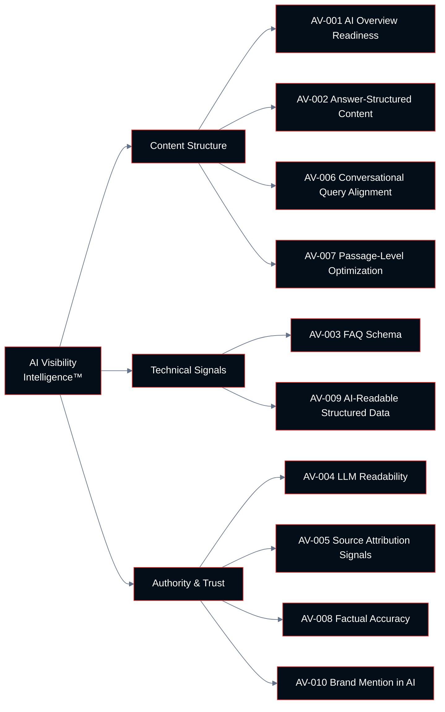

# Chapter 06: AI Visibility Intelligence™

**Growth AI SEO Audit Framework™**
Version 1.0.0 — Technocrats Digimate Pvt. Ltd.

---

## Pillar Overview

**Pillar:** AI Visibility Intelligence™
**Weight in Growth AI Score™:** 10%
**Checkpoint range:** AV-001 – AV-010
**Total checkpoints:** 10
**Maximum pillar score:** 30 (10 checkpoints × 3 points)

AI Visibility Intelligence™ evaluates a web property's readiness to be discovered, cited, and synthesized by AI-powered search products. These include Google's AI Overviews, AI-native search engines, and large language models that incorporate web search into their response generation.

This pillar represents an emerging but rapidly maturing optimization dimension. AI search products are not uniform in their content selection criteria, but consistent patterns have emerged across platforms that this pillar addresses.

---

## The AI Search Landscape

### What AI Search Products Are

AI search products use large language models (LLMs) to synthesize information from multiple web sources and generate a coherent response to a user query. Unlike traditional search results, which return a ranked list of links for the user to evaluate, AI search products:

- Generate a synthesized answer
- Attribute individual facts or excerpts to specific sources
- May include only a small number of cited sources (often 3–10)
- Are trained to prefer sources that are clear, factually accurate, and authoritative

### Key Platforms

**Google AI Overviews:** Appear in standard Google Search results for a significant proportion of queries. Sources are selected from the Google index. Inclusion is not guaranteed by high ranking — a page may rank well but not appear in AI Overviews.

**Perplexity:** An AI-native search engine that generates answers with cited sources. Uses its own crawler and selection criteria. Tends to favor authoritative, well-structured sources.

**ChatGPT with Search (OpenAI):** Incorporates web search via Microsoft Bing's index. Source selection criteria are not fully documented.

**Gemini:** Google's AI assistant, with web search capability drawing from the Google index.

### Why AI Visibility Is a Distinct Pillar

Being included in an AI-generated answer is materially different from ranking in traditional search results. The selection criteria differ, the content requirements differ, and the user behavior patterns differ. A site that performs well in traditional search may not perform well in AI search, and vice versa.

This pillar evaluates the specific properties that increase the probability of AI search inclusion.

---

## Architecture



---

## Checkpoint Index

| ID | Checkpoint | Domain | Priority if Failing |
|----|-----------|--------|---------------------|
| AV-001 | AI Overview inclusion readiness | Content Structure | High |
| AV-002 | Answer-structured content patterns | Content Structure | High |
| AV-003 | FAQ and Q&A schema implementation | Technical Signals | High |
| AV-004 | LLM readability and content clarity | Authority & Trust | High |
| AV-005 | Source citation and attribution signals | Authority & Trust | Medium |
| AV-006 | Conversational query alignment | Content Structure | Medium |
| AV-007 | Passage-level content optimization | Content Structure | Medium |
| AV-008 | Factual accuracy and verifiability | Authority & Trust | High |
| AV-009 | AI-readable structured data | Technical Signals | Medium |
| AV-010 | Brand mention in AI responses | Authority & Trust | Medium |

---

## AV-001: AI Overview Inclusion Readiness

**ID:** AV-001 | **Priority if Failing:** High

### Objective

Evaluate whether key pages meet the content and authority standards that correlate with inclusion in Google AI Overviews.

### Business Importance

AI Overviews appear above traditional organic results for a significant and growing proportion of search queries. Inclusion in an AI Overview provides visibility at a position above rank 1, with brand attribution. The traffic impact varies by query type, but visibility at this position is strategically significant.

### What Correlates with AI Overview Inclusion

Based on observed patterns (note: Google has not published definitive selection criteria):

- **High traditional ranking:** Pages that appear in positions 1–10 for the query are more likely to be included, but ranking alone is not sufficient
- **Direct answer to the query:** The page must contain a clear, direct answer to the user's question
- **Authoritative source signals:** EEAT signals, particularly expertise and trustworthiness
- **Structured information:** Content organized in a format that can be extracted without losing meaning
- **Factual accuracy:** AI systems are trained to prefer sources that are accurate and verifiable

### Step-by-Step Audit Procedure

**Step 1: Identify queries triggering AI Overviews**

Perform manual searches for the site's key target queries. Note which queries trigger AI Overviews and which do not.

**Step 2: Check for existing inclusion**

For queries that trigger AI Overviews, check whether the site's pages are included as cited sources.

**Step 3: Analyze included competitor content**

For queries where the site is not included but competitors are, analyze what the included pages have in common. Pay attention to: answer structure, content length, schema implementation, EEAT signals.

**Step 4: Identify high-opportunity queries**

Identify high-traffic queries where the site ranks in the top 10 but is not included in AI Overviews. These are the highest-priority optimization targets.

### Passing Criteria

- Site is included in AI Overviews for at least 50% of the queries it targets where AI Overviews appear
- Key commercial and informational pages contain direct, structured answers to their target queries

---

## AV-002: Answer-Structured Content Patterns

**ID:** AV-002 | **Priority if Failing:** High

### Objective

Evaluate whether content is structured to facilitate extraction of direct, accurate answers — the primary requirement for AI search inclusion.

### Answer Structure Patterns

AI search products extract specific patterns from web pages:

**The Direct Answer Pattern**
```
[Question or topic stated as heading]
[Direct, complete answer in 1–3 sentences immediately below the heading]
[Supporting context and detail following the direct answer]
```

**The Process Pattern**
```
[Topic heading]
[Brief overview sentence]
1. [Step with action verb and brief description]
2. [Step with action verb and brief description]
[Elaboration as needed]
```

**The Definition Pattern**
```
[Term heading]
[Term] is/are [definition in one complete sentence].
[Additional context and implications]
```

**The Comparison Pattern**
```
[Comparison heading]
| Feature | Option A | Option B |
[Text elaboration on most significant differences]
```

### Audit Approach

**Step 1:** Review key informational pages. For each page, identify whether a direct answer to the primary query appears within the first two paragraphs or under the first heading.

**Step 2:** Evaluate whether the direct answer can stand alone as a complete response without requiring reading context that precedes it.

**Step 3:** Identify pages where the answer is buried within long paragraphs or accessible only after reading a lengthy introduction.

### Passing Criteria

- Informational pages lead with a direct answer to the primary query before expanding into detail
- Content is organized in extractable patterns (question-answer, process steps, definitions, comparisons)
- No key informational pages bury the primary answer more than two scrolls into the page

---

## AV-003: FAQ and Q&A Schema Implementation

**ID:** AV-003 | **Priority if Failing:** High

### Objective

Evaluate whether FAQ schema is correctly implemented on pages with question-and-answer content, making those answers directly accessible to AI parsing systems.

### FAQ Schema Requirements

FAQ schema (`@type: "FAQPage"`) implements the following structure:

```json
{
  "@context": "https://schema.org",
  "@type": "FAQPage",
  "mainEntity": [
    {
      "@type": "Question",
      "name": "The question text",
      "acceptedAnswer": {
        "@type": "Answer",
        "text": "The complete answer text"
      }
    }
  ]
}
```

### Implementation Standards

- Each question must be answerable without requiring reading the surrounding page
- Answer text should be complete, factual, and concise (50–300 words)
- Schema must match the visible content on the page
- Do not implement FAQ schema on pages without genuine Q&A content

### Step-by-Step Audit Procedure

**Step 1: Identify FAQ-appropriate pages**

Identify pages with: FAQ sections, Help Center articles, product pages with specifications, or service pages with common questions.

**Step 2: Verify schema presence**

Check these pages for FAQPage schema in JSON-LD format.

**Step 3: Validate schema accuracy**

Confirm that schema question and answer text matches visible page content. AI systems may disregard or penalize schema that mismatches page content.

**Step 4: Test in Rich Results Test**

Validate for errors and preview appearance.

### Passing Criteria

- All pages with FAQ-appropriate content have FAQPage schema implemented
- Schema validates without critical errors
- Schema content accurately reflects visible page content

---

## AV-004: LLM Readability and Content Clarity

**ID:** AV-004 | **Priority if Failing:** High

### Objective

Evaluate whether content is written in a style that is clearly understandable to large language model parsing — direct, accurate, well-organized, and free from ambiguity.

### LLM Readability Factors

Large language models parse content by extracting meaning from natural language. Content that is ambiguous, jargon-heavy (without definition), metaphor-heavy, or written in a style that requires context to interpret is less reliably extracted than content that is direct and precise.

**High LLM readability:**
- Subject-verb-object sentence construction
- One idea per sentence
- Technical terms defined before use
- Active voice
- Consistent use of terminology (same concept referred to by the same term throughout)
- Explicit conclusions stated ("Therefore...", "This means...", "The result is...")

**Low LLM readability:**
- Long, compound sentences with multiple clauses
- Heavy use of idiom or colloquialism
- Anaphoric references that require context ("This approach...", "The above method...")
- Implicit conclusions left for the reader to infer
- Marketing language that prioritizes persuasion over accuracy

### Audit Approach

**Step 1:** Select a sample of key informational pages.

**Step 2:** For each page, read with the explicit goal of extracting a single, complete answer to the primary query. How many sentences of context are required before the answer can be stated?

**Step 3:** Identify sentences that would be ambiguous to a reader with no prior context. These represent LLM readability failures.

### Passing Criteria

- Key informational pages contain at least one self-contained, contextually complete answer to the primary query
- No significant proportion of content requires prior context to interpret correctly
- Technical terminology is defined on first use

---

## AV-005: Source Citation and Attribution Signals

**ID:** AV-005 | **Priority if Failing:** Medium

### Objective

Evaluate whether the site provides clear signals that allow AI systems to correctly attribute content — specifically, clear authorship, publication dates, and organizational attribution.

### Attribution Signals AI Systems Use

- **Authorship:** Clearly identified author with expertise signals in the same domain as the content
- **Organization:** Clear organizational affiliation of the author
- **Publication date:** When the content was first published
- **Last updated date:** When the content was last reviewed or updated
- **Primary source citations:** Where data and claims come from
- **Original research attribution:** Identifying when data is the site's own original research

### Implementation Checklist

- Author name visible on the page
- Author linked to bio page with expertise signals
- Publication date visible (and `datePublished` in structured data)
- Updated date visible when content has been substantively revised (and `dateModified` in structured data)
- Claims cite sources either with inline links or a references section
- Original data labeled as such ("In our analysis...", "Our research found...")

### Passing Criteria

- All major content pages have visible author attribution
- Publication and updated dates visible on all time-sensitive content
- Factual claims include source citations or are identified as original research

---

## AV-006: Conversational Query Alignment

**ID:** AV-006 | **Priority if Failing:** Medium

### Objective

Evaluate whether key content is optimized for conversational, long-form queries that are typical of AI search interfaces, in addition to the shorter query forms typical of traditional search.

### The Shift to Conversational Queries

AI search interfaces — particularly chat-style interfaces — encourage users to ask complete questions in natural language rather than entering keyword fragments. A user who would search Google for `best SEO audit tools` might ask an AI assistant `What are the best tools for conducting a technical SEO audit for an enterprise website in 2026?`

Content that performs well for short keywords may not be the most relevant source for the expanded conversational version of the same query.

### Conversational Query Optimization

- **Question-form headings:** Frame section headings as questions that users would naturally ask
- **Long-tail coverage:** Address the specific, qualified versions of queries (not just the head term)
- **Context-aware answers:** Answers that acknowledge different user contexts ("For a small site... For an enterprise site...")
- **Explicit scope definition:** "This guide covers..." statements that help AI systems identify the scope and audience of the content

### Passing Criteria

- Key informational pages include at least some content organized around question-form headings
- Long-tail and qualified versions of primary queries are addressed, not just the head term
- Content acknowledges audience variation where it exists

---

## AV-007: Passage-Level Content Optimization

**ID:** AV-007 | **Priority if Failing:** Medium

### Objective

Evaluate whether individual passages within pages are independently meaningful and well-structured, recognizing that AI systems often extract individual passages rather than full pages.

### Passage Indexing Context

Google has implemented passage indexing, which allows individual passages within a page to rank independently for specific queries, even when the overall page is not about that specific query. AI Overview systems similarly extract relevant passages, not entire pages.

This means that within a long-form page, individual sections should each:
- Begin with a heading that describes the section's content
- Start with the most important information for that section
- Be interpretable without reading the surrounding sections

### Audit Approach

**Step 1:** Take any two-paragraph section of a key content page.

**Step 2:** Read only those two paragraphs. Does the content make sense in isolation? Does it communicate a complete idea?

**Step 3:** Identify sections that only make sense in the context of what precedes them. These sections need restructuring for passage-level independence.

### Passing Criteria

- Major sections of key pages are independently meaningful with context provided by the section heading
- No major content section requires reading earlier sections to be understood

---

## AV-008: Factual Accuracy and Verifiability

**ID:** AV-008 | **Priority if Failing:** High

### Objective

Evaluate the factual accuracy of key content pages, and confirm that factual claims are either verifiable through cited sources or clearly identified as the site's own original analysis.

### Business Importance

AI systems are specifically designed to prefer factually accurate sources and to avoid including sources that have made demonstrably false claims. A single significant factual error on a key page can reduce the overall trustworthiness signal for the entire domain.

### Audit Approach

**Step 1:** Identify pages with factual claims — statistics, historical facts, technical specifications, regulatory requirements.

**Step 2:** Verify a sample of specific factual claims against primary sources.

**Step 3:** Identify any claims that cannot be verified because they lack source citations.

**Step 4:** Identify any claims that are demonstrably outdated (e.g., statistics from five or more years ago cited as current).

### Passing Criteria

- No demonstrably false factual claims on key content pages
- Statistics and data points cite sources (with dates)
- Outdated information is updated or removed
- Claims that represent estimates or projections are labeled as such

---

## AV-009: AI-Readable Structured Data

**ID:** AV-009 | **Priority if Failing:** Medium

### Objective

Evaluate whether structured data implementations provide entity and attribute information that AI systems can use to understand and summarize page content.

### Structured Data Types Most Relevant to AI Visibility

| Schema Type | AI Benefit |
|-------------|-----------|
| FAQPage | Enables direct Q&A extraction |
| HowTo | Enables step-by-step process extraction |
| Article | Provides author, date, and topic attribution |
| Product | Enables accurate product fact extraction |
| Review / AggregateRating | Provides consensus quality signals |
| Dataset | Makes data discoverable and attributable |
| Speakable | Marks content suitable for audio responses |

### Passing Criteria

- All pages have at least one relevant schema type implemented accurately
- Schema includes author, organization, and date properties where applicable
- No schema misrepresents page content

---

## AV-010: Brand Mention in AI Responses

**ID:** AV-010 | **Priority if Failing:** Medium

### Objective

Evaluate whether the brand is mentioned in AI-generated responses for its key topic areas, and establish a baseline for tracking AI visibility over time.

### Audit Methodology

Since AI search visibility is not reported in any current analytics tool, measurement requires manual testing.

**Step 1: Define AI visibility test queries**

Identify 20–30 queries in the brand's topic areas where AI responses might reference the brand or its content.

**Step 2: Test across AI platforms**

For each test query, record responses from: Google AI Overviews, Perplexity, and ChatGPT with search (where accessible). Note whether the brand is mentioned, cited, or excluded.

**Step 3: Establish a baseline**

Document the test date, queries tested, and visibility results. This creates a baseline for comparison in future audits.

**Step 4: Analyze exclusion patterns**

For queries where competitors are mentioned but the brand is not, analyze what the mentioned competitors have that the brand lacks in terms of content structure, authority, and schema.

### Passing Criteria

- Brand is mentioned in AI responses for at least 30% of queries where it is a relevant, authoritative source
- AI visibility test baseline is documented and can be compared in future audits

---

## Pillar Scoring Summary

When all 10 AI Visibility Intelligence™ checkpoints have been evaluated:

```
AI Visibility Pillar Score = (Sum of checkpoint scores / 30) × 100
```

Record all scores in the AI Visibility Scorecard.

For the composite Growth AI Score™, the AI Visibility Pillar Score is multiplied by 0.10 (its 10% weight).

---

*Next: [07-ux-intelligence.md](07-ux-intelligence.md) — UX Intelligence™ pillar*
