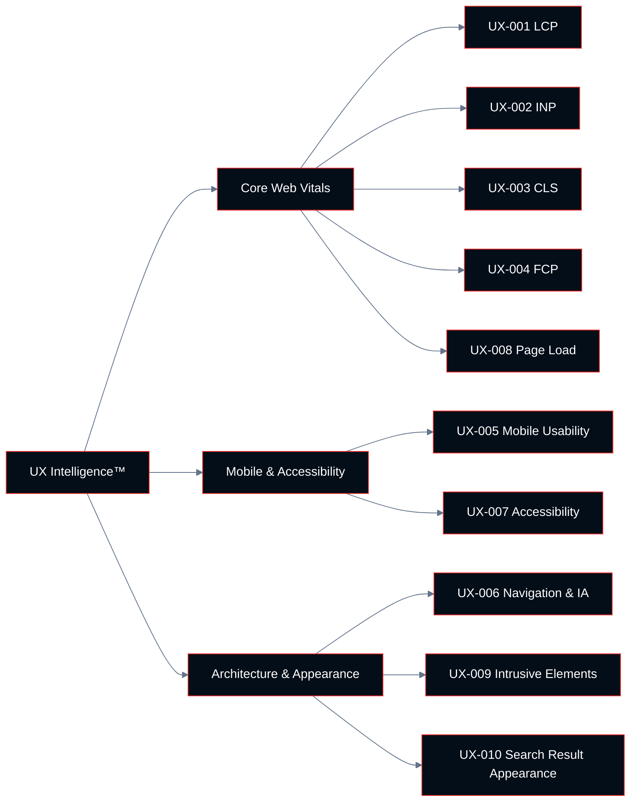

# Chapter 07: UX Intelligence™

**Growth AI SEO Audit Framework™**
Version 1.0.0 — Technocrats Digimate Pvt. Ltd.

---

## Pillar Overview

**Pillar:** UX Intelligence™
**Weight in Growth AI Score™:** 10%
**Checkpoint range:** UX-001 – UX-010
**Total checkpoints:** 10
**Maximum pillar score:** 30 (10 checkpoints × 3 points)

UX Intelligence™ evaluates the page experience signals that Google has confirmed as ranking factors, along with the broader user experience properties that determine whether visitors who arrive from search convert or abandon.

Since Google's Page Experience update and the introduction of Core Web Vitals as ranking factors, the distinction between UX and SEO has narrowed significantly. This pillar treats user experience as integral to search performance, not as a parallel concern.

---

## Core Web Vitals: The Confirmed Ranking Signals

Google's Core Web Vitals are a set of three performance metrics that measure real-world user experience. They are collected from actual Chrome user data (the Chrome User Experience Report, or CrUX) and from lab measurements. Field data (CrUX) is used for ranking signal purposes; lab data is used for diagnostics.

### Current Core Web Vitals Metrics (2026)

**Largest Contentful Paint (LCP):** Measures loading performance. Reports the render time of the largest visible content element in the viewport. Reflects how quickly the main content becomes visible to the user.

**Interaction to Next Paint (INP):** Measures responsiveness. Reports the latency of the worst interaction a user has with a page. Reflects how quickly the page responds to user input.

**Cumulative Layout Shift (CLS):** Measures visual stability. Reports the total amount of unexpected layout shift during the full page load. Reflects whether page content moves unexpectedly as it loads.

### Good, Needs Improvement, and Poor Thresholds

| Metric | Good | Needs Improvement | Poor |
|--------|------|-------------------|------|
| LCP | ≤ 2.5 seconds | 2.5 – 4.0 seconds | > 4.0 seconds |
| INP | ≤ 200 milliseconds | 200 – 500 milliseconds | > 500 milliseconds |
| CLS | ≤ 0.1 | 0.1 – 0.25 | > 0.25 |

---

## Architecture



---

## Checkpoint Index

| ID | Checkpoint | Domain | Priority if Failing |
|----|-----------|--------|---------------------|
| UX-001 | Largest Contentful Paint (LCP) | Core Web Vitals | Critical |
| UX-002 | Interaction to Next Paint (INP) | Core Web Vitals | Critical |
| UX-003 | Cumulative Layout Shift (CLS) | Core Web Vitals | High |
| UX-004 | First Contentful Paint (FCP) | Core Web Vitals | Medium |
| UX-005 | Mobile usability | Mobile | Critical |
| UX-006 | Navigation and information architecture | Architecture | High |
| UX-007 | Accessibility audit (WCAG 2.1 AA) | Accessibility | High |
| UX-008 | Page load performance | Architecture | High |
| UX-009 | Interstitials and intrusive elements | Architecture | High |
| UX-010 | Search result appearance | Appearance | Medium |

---

## UX-001: Largest Contentful Paint (LCP)

**ID:** UX-001 | **Priority if Failing:** Critical

### Objective

Measure and evaluate the Largest Contentful Paint score for key page types on mobile and desktop, and identify the specific elements and causes contributing to slow LCP scores.

### Business Importance

LCP is a direct ranking factor and directly correlates with conversion rate. Pages that take more than 2.5 seconds to display their largest content element lose users at measurably higher rates than pages that load in under 2.5 seconds.

### Google Search Importance

LCP is a confirmed Core Web Vitals ranking signal. Google uses field data from the CrUX dataset for ranking. Sites where the 75th percentile of page loads (across a 28-day rolling window) achieves Good LCP receive a ranking signal benefit over equivalent pages that do not.

### Common LCP Culprits

| Culprit | Cause | Fix |
|---------|-------|-----|
| Slow server response | Unoptimized backend, no caching | Server optimization, CDN, caching |
| Render-blocking resources | CSS and JS loaded before content | Defer non-critical resources |
| Slow resource load | Large images, unoptimized assets | Image optimization, compression |
| Client-side rendering | Content generated by JS | SSR or SSG implementation |
| No resource hints | Browser discovers LCP element late | `<link rel="preload">` for LCP element |

### Step-by-Step Audit Procedure

**Step 1: Check Search Console Core Web Vitals report**

Review the Core Web Vitals report in Search Console for the distribution of pages across Good / Needs Improvement / Poor for LCP, on both mobile and desktop.

**Step 2: Use PageSpeed Insights for field data**

Test key page types with PageSpeed Insights to see field data (CrUX) and lab data (Lighthouse). Note the LCP element identified.

**Step 3: Identify the LCP element**

The LCP element is usually: the hero image, a large text block, or a video poster. Identify this element for each key page type.

**Step 4: Trace the loading waterfall**

Use Chrome DevTools Performance panel to trace the loading waterfall. Identify: time to first byte (TTFB), when the LCP element is discovered, and when it renders.

**Step 5: Identify contributing factors**

Based on the waterfall, identify what is delaying LCP: TTFB, resource discovery, resource load time, or render delay.

### Passing Criteria

- LCP is in the Good range (≤ 2.5s) for the 75th percentile of page loads on mobile and desktop
- Field data in Search Console shows no pages in the Poor category for LCP

### Common Causes and Fixes

**LCP image not preloaded:**
```html
<link rel="preload" as="image" href="/hero-image.webp" fetchpriority="high">
```

**LCP image not optimized:**
- Serve in WebP or AVIF format
- Use responsive images with correct `srcset`
- Compress to appropriate file size for display dimensions

**Slow TTFB:**
- Implement server-side caching
- Move to edge/CDN delivery
- Optimize server response time

---

## UX-002: Interaction to Next Paint (INP)

**ID:** UX-002 | **Priority if Failing:** Critical

### Objective

Measure and evaluate INP for key page types and identify JavaScript execution patterns that are causing input delays.

### What INP Measures

INP measures the latency between a user interaction (click, tap, keyboard input) and the next visual response from the page. High INP means the page feels unresponsive — users click buttons and experience a delay before the page acknowledges the action.

INP replaced First Input Delay (FID) as a Core Web Vitals metric in March 2024. Unlike FID, which measured only the first interaction, INP reports the worst interaction observed throughout the entire page session.

### Common INP Causes

- **Long tasks on the main thread:** JavaScript tasks that take more than 50ms block the browser's ability to respond to input. These must be broken up with `setTimeout` or `scheduler.yield()`.
- **Heavy event handlers:** Click or keyboard event handlers that perform expensive calculations
- **DOM size:** Very large DOMs increase the cost of style calculations and layout operations triggered by interactions
- **Third-party scripts:** Analytics, chat widgets, and advertising scripts that run on the main thread

### Step-by-Step Audit Procedure

**Step 1: Get field data**

PageSpeed Insights shows INP field data from CrUX. Check the INP value for key page types.

**Step 2: Profile interactions in DevTools**

Use Chrome DevTools Performance panel. Click "Record" and perform typical user interactions. Review the recorded trace for long tasks (shown in red) that correlate with interactions.

**Step 3: Identify the blocking task**

For each long task, identify the script responsible. This is usually shown in the call stack.

**Step 4: Identify fix strategy**

- Break up long tasks
- Defer non-critical JavaScript
- Remove or defer third-party scripts loaded synchronously

### Passing Criteria

- INP is in the Good range (≤ 200ms) for the 75th percentile of interactions on mobile
- No identifiable long tasks exceeding 200ms during typical user interactions on key page types

---

## UX-003: Cumulative Layout Shift (CLS)

**ID:** UX-003 | **Priority if Failing:** High

### Objective

Measure and evaluate CLS for key pages and identify the elements that are causing unexpected layout shifts during page load.

### What CLS Measures

CLS measures the total unexpected movement of page content during its lifetime. Each time a visible element moves unexpectedly, the movement contributes to the CLS score. A score of 0.1 or below indicates minimal unexpected movement.

### Common CLS Causes

- **Images without size attributes:** When a browser loads an image without knowing its dimensions, it cannot reserve space, causing a shift when the image loads
- **Ads and embeds without reserved space:** Dynamic content inserted into the page without pre-allocated space
- **Web fonts causing FOUT/FOIT:** Flash of Unstyled Text or Flash of Invisible Text as fonts load
- **Dynamic content injection:** Content injected above existing content (banners, cookie notices)
- **CSS animations that affect layout:** Animations that change `width`, `height`, `top`, `left` properties

### Fixes for Common CLS Causes

**Images:**
```html
<!-- Always specify width and height -->

```

**Web fonts:**
```css
/* Use font-display: optional to prevent layout shift */
@font-face {
  font-display: optional;
}
```

**Dynamic content:**
```css
/* Reserve space for dynamic elements */
.ad-container {
  min-height: 250px;
}
```

### Passing Criteria

- CLS is in the Good range (≤ 0.1) for the 75th percentile of page loads on mobile and desktop
- All images have explicit `width` and `height` attributes
- No ads or dynamic content loads without pre-allocated space

---

## UX-004: First Contentful Paint (FCP)

**ID:** UX-004 | **Priority if Failing:** Medium

### Objective

Evaluate First Contentful Paint as a diagnostic metric for perceived loading performance. FCP is not a Core Web Vitals ranking signal but is a useful diagnostic indicator of how quickly users see any content.

### FCP Thresholds

| Classification | FCP |
|---------------|-----|
| Good | ≤ 1.8 seconds |
| Needs Improvement | 1.8 – 3.0 seconds |
| Poor | > 3.0 seconds |

### Relationship to LCP

FCP fires when the first content element renders. LCP fires when the largest content element renders. FCP is always earlier than LCP. Slow FCP is typically caused by render-blocking resources or slow TTFB, and these same causes will also slow LCP.

---

## UX-005: Mobile Usability

**ID:** UX-005 | **Priority if Failing:** Critical

### Objective

Verify that the site has no mobile usability errors as documented in Google Search Console, and that the mobile user experience meets the standards required for mobile-first indexing.

### Mobile Usability Issues Tracked by Google

| Issue | Description |
|-------|-------------|
| Text too small to read | Text below 12px font size on mobile |
| Clickable elements too close together | Touch targets under 48x48px or with less than 8px spacing |
| Content wider than screen | Horizontal scrolling required |
| Viewport not set | Missing or incorrect viewport meta tag |
| Uses incompatible plugins | Flash or other non-mobile-compatible plugins |

### Step-by-Step Audit Procedure

**Step 1: Review Search Console Mobile Usability report**

Export all URLs with mobile usability errors from Search Console.

**Step 2: Test key pages in mobile emulation**

Use Chrome DevTools Device Mode to test key page types at 375px and 414px viewport widths.

**Step 3: Test touch target sizes**

Use the Chrome Lighthouse audit for "Tap targets are not sized appropriately."

**Step 4: Verify viewport meta tag**

Check that all pages include:
```html
<meta name="viewport" content="width=device-width, initial-scale=1">
```

### Passing Criteria

- No Mobile Usability errors in Search Console
- All interactive elements have touch targets of at least 48x48px
- No content requires horizontal scrolling on standard mobile viewport widths
- Viewport meta tag present on all pages

---

## UX-006: Navigation and Information Architecture

**ID:** UX-006 | **Priority if Failing:** High

### Objective

Evaluate whether the site's navigation structure allows users to find what they are looking for efficiently, and whether the information architecture reflects user mental models.

### Navigation Evaluation Criteria

**Clarity:** Navigation labels are descriptive of the content they lead to. Users can predict where a label will take them without clicking.

**Depth:** Navigation hierarchy is appropriate to site size. Shallow hierarchies (3 levels maximum for most sites) are preferable.

**Consistency:** Navigation is consistent across all page types and does not vary in a confusing way between sections.

**Priority:** High-value pages (product pages, contact pages, pricing) are accessible from the primary navigation.

**Breadcrumbs:** Deep content pages include breadcrumb navigation showing location within the site hierarchy.

### Step-by-Step Audit Procedure

**Step 1: Map the navigation structure**

Document the primary navigation: top-level items, second-level dropdowns, and any tertiary navigation.

**Step 2: Evaluate label clarity**

For each navigation label, assess whether it is descriptive of the content behind it. Labels like "Solutions", "Resources", and "Services" are often ambiguous. Labels like "SEO Audit Services", "Case Studies", and "Pricing" are specific.

**Step 3: Test click depth**

From the homepage, count the minimum number of clicks to reach:
- The highest-value product or service page
- The contact or inquiry page
- The most important content page (guide, case study)

Key pages should require no more than two clicks.

**Step 4: Evaluate mobile navigation**

Test navigation on mobile. Confirm that hamburger menu or equivalent is usable, that dropdowns work on touch, and that all navigation items are accessible.

### Passing Criteria

- Primary navigation labels are specific and predictive
- All high-priority pages reachable within two clicks from homepage
- Breadcrumbs present on all pages more than two levels deep
- Mobile navigation functions correctly

---

## UX-007: Accessibility Audit (WCAG 2.1 AA)

**ID:** UX-007 | **Priority if Failing:** High

### Objective

Evaluate whether the site meets WCAG 2.1 Level AA accessibility standards, which are the internationally recognized minimum standard for web accessibility.

### Business Importance

Accessibility is increasingly required by law in many jurisdictions (ADA, EN 301 549, EAA). Beyond legal compliance, accessible sites are usable by a broader audience and tend to perform better on SEO metrics because the practices that make content accessible (semantic HTML, clear structure, descriptive labels) also make content more parseable by search engines.

### Key WCAG 2.1 AA Criteria

**Perceivable:**
- Text alternatives for all non-text content (alt text for images)
- Captions for video content
- Color contrast ratio ≥ 4.5:1 for normal text, ≥ 3:1 for large text
- Content not conveyed by color alone

**Operable:**
- All functionality accessible via keyboard
- No content that requires more than 3 flashes per second
- Skip navigation link present
- Descriptive page titles

**Understandable:**
- Language of the page declared in HTML
- Error messages identify and describe errors clearly
- Form labels associated with their inputs

**Robust:**
- Valid HTML (no parsing errors)
- ARIA roles and attributes correctly used

### Step-by-Step Audit Procedure

**Step 1: Automated scan**

Run an automated accessibility scan using a tool (axe DevTools, Lighthouse accessibility audit, WAVE). Automated tools can detect approximately 30–40% of WCAG failures.

**Step 2: Manual keyboard testing**

Navigate the site using only the keyboard (Tab, Enter, Arrow keys, Esc). Verify that all interactive elements are reachable and usable.

**Step 3: Screen reader testing**

Test key pages with a screen reader (NVDA on Windows, VoiceOver on macOS/iOS). Verify that content is presented in a logical order and that all interactive elements have appropriate labels.

**Step 4: Color contrast check**

Test color contrast ratios for all text on key pages.

### Passing Criteria

- No automated scan critical errors on key page types
- All interactive elements operable by keyboard
- All images have descriptive alt text (or empty alt="" for decorative images)
- Text color contrast meets WCAG 4.5:1 minimum

---

## UX-008: Page Load Performance

**ID:** UX-008 | **Priority if Failing:** High

### Objective

Evaluate overall page load performance beyond Core Web Vitals, including Time to First Byte (TTFB) and total page weight.

### Performance Metrics

| Metric | Good | Needs Improvement |
|--------|------|-------------------|
| Time to First Byte (TTFB) | < 800ms | 800ms – 1800ms |
| Total blocking time (TBT) | < 200ms | 200ms – 600ms |
| Speed Index | < 3.4s | 3.4s – 5.8s |

### Common Performance Improvements

- Implement server-side or edge caching
- Compress and optimize images
- Minify CSS and JavaScript
- Remove unused CSS and JavaScript
- Implement lazy loading for below-the-fold images
- Use a CDN for static asset delivery
- Implement resource hints (preconnect, preload, prefetch)

---

## UX-009: Interstitials and Intrusive Elements

**ID:** UX-009 | **Priority if Failing:** High

### Objective

Evaluate whether the site uses intrusive interstitials (popups, overlays, banners) that Google has documented as negative page experience signals.

### Google's Intrusive Interstitial Policy

Google has documented that the following types of interstitials create a negative page experience signal:

- Popups that cover the main content immediately after page load, before the user has interacted with the page
- Standalone interstitials that must be dismissed before content is accessible
- Above-the-fold layouts where the content below the fold is not accessible without scrolling past an interstitial

**Exempt from this policy:**
- Cookie consent notices (required by law)
- Age verification notices (legally required)
- Login-required access (subscription or login-only content)
- Small banners that do not obscure the main content

### Passing Criteria

- No popups cover main content on page load for first-time visitors arriving from search
- Cookie consent banners do not obscure primary content
- No interstitials require dismissal before the main content is accessible

---

## UX-010: Search Result Appearance

**ID:** UX-010 | **Priority if Failing:** Medium

### Objective

Evaluate how the site's pages appear in search results — the presentation of titles, descriptions, sitelinks, rich results, and other SERP features — as this directly affects click-through rates.

### SERP Appearance Elements

**Standard result elements:**
- Title tag (displayed as the blue link)
- Meta description (displayed as the summary text)
- URL (displayed breadcrumb path)
- Date (shown for recent or time-sensitive content)

**Enhanced result elements (require eligibility):**
- Sitelinks (shown for brand queries on sites with high authority)
- Review stars (requires Review schema and eligibility criteria)
- FAQ accordion (requires FAQPage schema)
- Product information (requires Product schema)
- Breadcrumb rich result (requires BreadcrumbList schema)

### Step-by-Step Audit Procedure

**Step 1: Search for key brand and non-brand queries**

Observe how pages appear in SERP for brand queries and top commercial queries.

**Step 2: Compare displayed title with declared title**

Note any queries where Google is displaying a different title than the declared title tag. Document the declared title and Google's replacement.

**Step 3: Evaluate meta description display**

Check whether meta descriptions are being displayed or replaced with page-extracted text. When meta descriptions are consistently replaced, it indicates they are not well-aligned with the query.

**Step 4: Identify rich result opportunities**

Identify page types that are eligible for rich results but do not currently appear with them.

### Passing Criteria

- Fewer than 10% of titles are being rewritten by Google
- Key commercial pages appear with at least one enhanced SERP feature
- Structured data validated and eligible for rich results on applicable page types

---

## Pillar Scoring Summary

When all 10 UX Intelligence™ checkpoints have been evaluated:

```
UX Pillar Score = (Sum of checkpoint scores / 30) × 100
```

Record all scores in the UX Scorecard.

For the composite Growth AI Score™, the UX Pillar Score is multiplied by 0.10 (its 10% weight).

---

*Next: [08-conversion-intelligence.md](08-conversion-intelligence.md) — Conversion Intelligence™ pillar*
