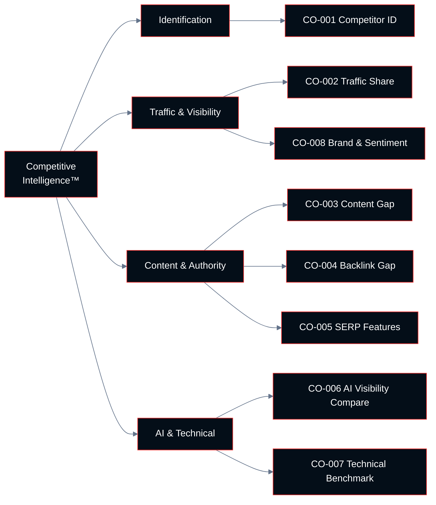

# Chapter 10: Competitive Intelligence™

**Growth AI SEO Audit Framework™**
Version 1.0.0 — Technocrats Digimate Pvt. Ltd.

---

## Pillar Overview

**Pillar:** Competitive Intelligence™
**Weight in Growth AI Score™:** 5%
**Checkpoint range:** CO-001 – CO-008
**Total checkpoints:** 8
**Maximum pillar score:** 24 (8 checkpoints × 3 points)

Competitive Intelligence™ provides the context within which all other pillar findings must be interpreted. An organic traffic decline is not inherently alarming if the entire competitive set has declined. A strong backlink profile may be insufficient if every competitor has a stronger one.

This pillar carries the lowest weight in the Growth AI Score™ not because competitive intelligence is unimportant, but because it is contextual rather than prescriptive. Competitive findings inform the prioritization of work across all other pillars — they do not themselves constitute improvements.

---

## The Role of Competitive Context

SEO operates in a competitive market. Every ranking position is held by one site and coveted by multiple others. Understanding where competitors stand — across technical infrastructure, content depth, authority signals, and AI visibility — determines what level of investment is required to achieve or maintain competitive positions.

Competitive intelligence answers the questions that absolute metrics cannot:

- Is our technical health sufficient to compete effectively?
- Are our content gaps larger or smaller than competitors' content gaps relative to us?
- How far is our backlink profile from what our competitors have built?
- Which competitors are positioning effectively for AI search inclusion?

---

## Architecture



---

## Checkpoint Index

| ID | Checkpoint | Domain | Priority if Failing |
|----|-----------|--------|---------------------|
| CO-001 | Primary competitor identification | Identification | High |
| CO-002 | Organic traffic share comparison | Traffic | High |
| CO-003 | Content gap analysis | Content | High |
| CO-004 | Backlink gap analysis | Authority | High |
| CO-005 | SERP feature capture comparison | Visibility | Medium |
| CO-006 | AI visibility competitor assessment | AI | Medium |
| CO-007 | Technical benchmark comparison | Technical | Medium |
| CO-008 | Brand search and sentiment comparison | Brand | Medium |

---

## CO-001: Primary Competitor Identification

**ID:** CO-001 | **Priority if Failing:** High

### Objective

Identify the primary organic search competitors — the sites that consistently appear in the same SERPs as the evaluated site for its most important queries.

### Business Importance

Many organizations identify their primary competitors as the companies they compete with commercially (direct business competitors). Organic competitors — the sites that compete for the same search queries — are frequently different. An e-commerce brand may face Wikipedia, review sites, and content publishers as organic competitors rather than other brands.

Competitive analysis based on the wrong competitor set produces irrelevant insights and ineffective prioritization.

### Two Categories of Organic Competitors

**Direct competitors:** Companies that offer the same or similar products and services to the same audience. They compete both commercially and in organic search.

**Indirect competitors:** Sites that rank for the same queries without offering the same product or service. These may be information sites, aggregators, review platforms, or media properties.

Both categories are relevant. Indirect competitors often hold the top positions for informational queries that drive awareness, and their content strategies reveal what works in the target query space.

### Step-by-Step Audit Procedure

**Step 1: Extract top competing domains from a keyword tool**

In Ahrefs, Semrush, or similar: use the "Competing Domains" or "Organic Competitors" report. This shows which domains share the most keyword overlap with the evaluated site.

**Step 2: Identify SERP competitors for priority queries**

For the site's top 10 most important commercial queries, manually review the top 10 results. Create a frequency table of domains appearing in these results.

**Step 3: Cross-reference**

Combine the keyword tool competitor list with the manual SERP analysis. The domains that appear consistently across both represent the true organic competitor set.

**Step 4: Segment into direct and indirect**

Classify each identified competitor as direct (offers same products/services) or indirect (ranks for same queries but different business model).

### Passing Criteria

- Primary organic competitors identified through data, not assumption
- Competitor set includes both direct and indirect competitors
- Competitor list is segmented by direct vs. indirect
- Competitor list is current (search landscapes change)

---

## CO-002: Organic Traffic Share Comparison

**ID:** CO-002 | **Priority if Failing:** High

### Objective

Benchmark the evaluated site's estimated organic traffic share against primary competitors to establish relative search visibility.

### Organic Traffic Estimation

Third-party tools estimate organic traffic by combining keyword ranking data with estimated click-through rates for each position. These estimates are approximations, not precise figures. The value is in relative comparison, not absolute measurement.

### Metrics to Compare

For each primary competitor:
- Estimated monthly organic traffic (tool-based)
- Number of keywords ranking in top 10 positions
- Number of keywords ranking in top 3 positions
- Traffic trend (growing, stable, declining) over 12 months

### Traffic Share Analysis

Plot traffic share across the competitive set:

```
Total estimated traffic (all competitors + evaluated site)
÷ Evaluated site's estimated traffic
= Evaluated site's traffic share %
```

A traffic share below the evaluated site's market position expectation indicates room for growth or indicates a current competitive deficit.

### Passing Criteria

- Traffic share benchmarked against primary competitors
- 12-month traffic trend documented
- Sites gaining or losing traffic identified and reason investigated

---

## CO-003: Content Gap Analysis

**ID:** CO-003 | **Priority if Failing:** High

### Objective

Identify keywords and topics that primary competitors rank for but the evaluated site does not, representing content creation or optimization opportunities.

### Business Importance

Content gaps represent traffic the evaluated site is not capturing that competitors are. These gaps are actionable — they can be addressed through content creation or optimization and have demonstrably achievable rankings (because competitors already rank for them).

### Step-by-Step Audit Procedure

**Step 1: Run content gap analysis in keyword tool**

Most tools (Ahrefs, Semrush) have a "Content Gap" or "Keyword Gap" function that directly compares keyword rankings across multiple domains.

Input: the evaluated site's domain and two to three primary competitors. Output: keywords where competitors rank and the evaluated site does not.

**Step 2: Filter for relevant, valuable gaps**

From the gap keyword list, filter by:
- Search volume (remove very low-volume terms)
- Relevance (remove queries that are not relevant to the business)
- Competition difficulty (prioritize opportunities where at least one competitor ranks in top 3)

**Step 3: Cluster gap keywords into topics**

Group gap keywords into topic clusters. Evaluate whether each cluster:
- Requires a new page
- Could be addressed by improving an existing page
- Requires multiple new pages for comprehensive coverage

**Step 4: Prioritize by business value**

Order topic clusters by the business value of the traffic they would produce (informational vs. commercial intent, transaction value).

### Passing Criteria

- Content gap analysis completed against at least two primary competitors
- Gap keywords clustered into actionable topic groups
- Top 10 content gap priorities identified with content recommendations

---

## CO-004: Backlink Gap Analysis

**ID:** CO-004 | **Priority if Failing:** High

### Objective

Identify referring domains that link to primary competitors but not to the evaluated site, providing a prioritized list of realistic link acquisition targets.

*(See also: AI-006 in Authority Intelligence™ pillar, which covers the same checkpoint from a link-building strategy perspective. This checkpoint evaluates the competitive context.)*

### Step-by-Step Audit Procedure

**Step 1: Export competitor backlink profiles**

Use a backlink tool to export referring domains for two to three primary competitors.

**Step 2: Identify gap domains**

Find domains that link to at least two competitors but not the evaluated site.

**Step 3: Assess the competitive authority gap**

Compare total referring domain counts:
- Evaluated site: [X] referring domains
- Competitor A: [Y] referring domains
- Competitor B: [Z] referring domains

The ratio between the evaluated site and leading competitors indicates the scale of the authority gap.

**Step 4: Identify quick-win opportunities**

Among gap domains, identify those that:
- Are topically relevant
- Have editorial content (not link directories)
- Have linked to the evaluated site's competitors with a contextual link (suggesting editorial willingness)

### Passing Criteria

- Backlink gap analysis completed against at least two primary competitors
- Authority gap (referring domain count differential) quantified
- Top 20 gap domain opportunities identified and qualified

---

## CO-005: SERP Feature Capture Comparison

**ID:** CO-005 | **Priority if Failing:** Medium

### Objective

Compare the evaluated site's capture rate of SERP features — featured snippets, Knowledge Panels, AI Overviews, image packs, video carousels, People Also Ask boxes — against primary competitors.

### Business Importance

SERP features expand the share of the search results page that a site occupies, increasing visibility without necessarily improving traditional ranking positions. A site that ranks in position 3 but also holds the featured snippet occupies significantly more SERP real estate than a site at the same position without enhanced features.

### SERP Feature Inventory

| Feature | How to Audit |
|---------|-------------|
| Featured snippets | Track using keyword tool's SERP features filter |
| AI Overviews | Manual testing by query |
| People Also Ask | Keyword tool + manual testing |
| Image pack | Manual testing for relevant image queries |
| Video carousel | Manual testing for video content queries |
| Knowledge Panel | Manual brand query check |
| Local pack | Manual local query check |
| Review stars | Rich Results Test on product/service pages |

### Passing Criteria

- Site's SERP feature capture rate benchmarked against primary competitors
- Key SERP features captured by competitors but not the evaluated site identified
- Action items defined for each missing feature opportunity

---

## CO-006: AI Visibility Competitor Assessment

**ID:** CO-006 | **Priority if Failing:** Medium

### Objective

Evaluate how primary competitors are appearing in AI-generated search responses compared to the evaluated site, to identify AI visibility gaps.

### Step-by-Step Audit Procedure

**Step 1: Define AI visibility test queries**

Use the same test queries defined in AV-010 (AI Visibility Intelligence™ pillar).

**Step 2: Record competitor AI citations**

For each test query, record which sources are cited in AI-generated responses. Note whether competitors are cited and whether the evaluated site is cited.

**Step 3: Analyze competitor content that drives AI inclusion**

For queries where a competitor is cited in AI Overviews or AI responses but the evaluated site is not, review the competitor's cited content. Identify:
- Content structure differences
- Schema implementation
- Content depth differences
- EEAT signal differences

**Step 4: Identify structural advantages**

Determine whether competitors are winning AI visibility through:
- Better answer structure
- Greater topical authority
- Superior EEAT signals
- More comprehensive schema implementation

### Passing Criteria

- AI visibility comparison completed for key query set
- Competitors consistently outperforming in AI citations identified
- Structural reasons for the gap identified and mapped to remediation checkpoints

---

## CO-007: Technical Benchmark Comparison

**ID:** CO-007 | **Priority if Failing:** Medium

### Objective

Compare the evaluated site's technical performance — Core Web Vitals, crawl health, and structured data implementation — against primary competitors to identify relative technical advantages or deficits.

### Step-by-Step Audit Procedure

**Step 1: Run PageSpeed Insights for competitors**

Test the homepage and one key page type for each primary competitor using PageSpeed Insights. Record LCP, INP, and CLS field data where available.

**Step 2: Compare Core Web Vitals**

Build a comparison table:

| Site | LCP | INP | CLS |
|------|-----|-----|-----|
| Evaluated site | | | |
| Competitor A | | | |
| Competitor B | | | |

**Step 3: Compare structured data implementation**

Using the Rich Results Test or a crawl tool, check key pages on competitor sites for structured data implementation. Identify schema types implemented by competitors that the evaluated site lacks.

**Step 4: Compare indexation health**

Using Search Console data (for the evaluated site) and estimated crawl data (for competitors), compare indexation patterns and any known technical issues.

### Passing Criteria

- Core Web Vitals compared to at least two primary competitors
- Structured data implementation benchmarked against primary competitors
- Technical areas where competitors have clear advantages identified

---

## CO-008: Brand Search and Sentiment Comparison

**ID:** CO-008 | **Priority if Failing:** Medium

### Objective

Compare brand search volume, search trend, and brand sentiment signals between the evaluated site and primary competitors.

### Business Importance

Brand search volume is both a business health metric and a search relevance signal. Google has documented that brand search behavior — users searching specifically for a brand — is used as a quality signal in the ranking algorithm. A brand with growing search volume and positive sentiment benefits from this signal.

### Metrics to Evaluate

**Brand search volume:**
Use Google Trends or keyword tool data to compare brand search volume trends for the evaluated site vs. primary competitors over 12 months.

**Brand sentiment:**
Review the first two pages of Google results for each brand name. Assess whether results are predominantly positive, neutral, or negative.

**Knowledge Panel presence:**
Compare whether each competitor has a Knowledge Panel (indicating recognized entity status) vs. the evaluated site.

**Review ratings:**
Compare aggregate review ratings on Google Business Profile, Trustpilot, G2, or industry-specific review platforms.

### Passing Criteria

- Brand search volume trend documented and compared to primary competitors
- Brand sentiment review completed (SERP-level assessment)
- No significant reputation issues identified in brand SERP results

---

## Competitive Intelligence Summary

The Competitive Intelligence™ pillar consolidates findings from other pillars into a relative perspective. Every finding from this pillar should be mapped to the corresponding pillar for remediation:

| Competitive Finding | Primary Remediation Pillar |
|--------------------|---------------------------|
| Traffic share deficit | Content Intelligence™, Authority Intelligence™ |
| Content gap | Content Intelligence™ |
| Backlink gap | Authority Intelligence™ |
| SERP feature gap | Content Intelligence™, Entity Intelligence™ |
| AI visibility gap | AI Visibility Intelligence™ |
| Technical performance gap | Technical Intelligence™, UX Intelligence™ |
| Brand signal gap | Entity Intelligence™, Authority Intelligence™ |

---

## Pillar Scoring Summary

When all 8 Competitive Intelligence™ checkpoints have been evaluated:

```
Competitive Pillar Score = (Sum of checkpoint scores / 24) × 100
```

Record all scores in the Competitive Scorecard.

For the composite Growth AI Score™, the Competitive Pillar Score is multiplied by 0.05 (its 5% weight).

---

## Framework Complete

With the completion of Chapter 10, all nine intelligence pillars have been defined and their checkpoints specified. The Growth AI Score™ can now be calculated using the scores from all pillars:

```
Growth AI Score™ =
  (Technical Score × 0.20) +
  (Content Score × 0.18) +
  (Authority Score × 0.12) +
  (Entity Score × 0.10) +
  (AI Visibility Score × 0.10) +
  (UX Score × 0.10) +
  (Conversion Score × 0.08) +
  (Analytics Score × 0.07) +
  (Competitive Score × 0.05)
```

Refer to:
- `/SCORING.md` for the complete scoring specification
- `/scorecards/growth-ai-scorecard.md` for the master scorecard
- `/templates/audit-report-template.md` for the full report template
- `/appendix/glossary.md` for term definitions

---

*End of Chapter 10 — Growth AI SEO Audit Framework™ v1.0.0*
